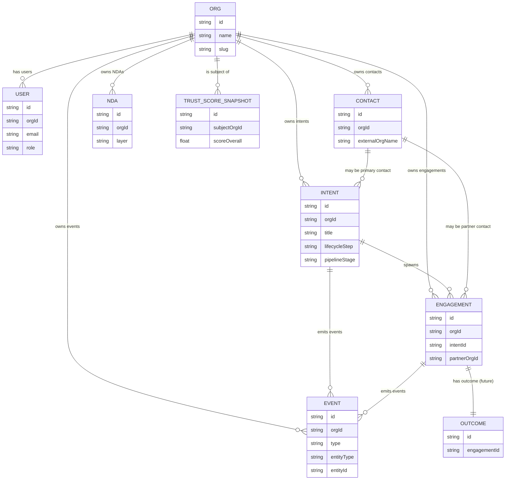

# BCOS Data & Event Model v1 (MVP)
Status: Internal / M0
Version: 0.1 (draft for R1.0)
Source of truth: Issue #2, Phase1_MVP-Spec (section 16), Architecture Overview R1.0 MVP

## 16. BCOS Data & Event Model v1 (MVP)

### 16.1 Goals and design principles

**Goal**

Provide a single, canonical **BCOS Data & Event Model v1** for R1.0 that:

1. Aligns with the Enabion Playbook (CONNECTâ€"POWERâ€"GROW and the 5â€'Step Partnership Lifecycle).   
2. Covers all R1.0 preâ€'sales flows: **Intent â†' Avatars â†' Match â†' NDA â†' Commit**.   
3. Is **multiâ€'tenant, RBACâ€'aware and eventâ€'sourced** from day one.  
4. Is forwardâ€'compatible with R2.0+ (Deliver, Issues/Disputes, Outcome, TrustGraph, Models 2â€"3).  

**Design principles**

- **Protocolâ€'first** â€" every meaningful change in the system must be representable as a BCOS event.  
- **Minimal but complete** â€" only entities required for R1.0 are implemented, but their shapes anticipate R2.0+.  
- **Multiâ€'tenant by default** â€" every domain record is scoped to an organisation (tenant) and later extendable to multiâ€'party engagements.  
- **RBACâ€'aware** â€" the model encodes the roles and access patterns required for R1.0 (Owner, Manager, Contributor, Viewer).   
- **Clear migration path** â€" evolving from R1.0 to later releases should not require breaking schema changes.

---

### 16.2 Core entities â€" overview

R1.0 uses the following core entities (Model 1 â€" Standard):   

1. **Org** â€" Enabion organisation account (tenant) representing a company X or Y.  
2. **User** â€" a person belonging to an Org (BD/AM, PM, CEO, etc.).  
3. **Contact** â€" business contact related to an Intent or Engagement (mostly external to the Org).  
4. **Intent** â€" structured representation of a business need from firm X; single source of truth for preâ€'sales.   
5. **Engagement (preâ€'sales)** â€" Xâ†"Y relationship in the preâ€'sales phase for a given Intent (e.g. “X â†" BrightCode for Intent #123”).   
6. **NDA** â€" representation of NDA status between parties (focus on Layer 0 and Layer 1 in R1.0).   
7. **Event** â€" canonical event log entry (Enabion Event Model / protocol of events).   
8. **TrustScoreSnapshot** â€" snapshot of a simple behavioural TrustScore (MVP).   
9. **Outcome (skeleton)** â€" future entity for delivery outcomes; shape defined now, not used in R1.0.   

These entities are sufficient to:

- manage Intents and preâ€'sales pipeline for X,  
- log Avatar work and human decisions as events,  
- track NDA status at preâ€'sales level,  
- compute a minimal behavioural TrustScore.

---

### 16.3 Crossâ€'cutting technical fields

All domain entities share the following **technical / audit fields** (not repeated in each table):

- `id` â€" ULID string, primary key (e.g. `org_01HZX…`, `intent_01HZX…`).  
- `createdAt` â€" timestamp (UTC).  
- `updatedAt` â€" timestamp (UTC).  
- `createdByUserId` â€" ULID of the user who created the record (nullable for systemâ€'created records).  
- `updatedByUserId` â€" ULID of the user who last updated the record.  
- `orgId` â€" ULID of the owning Org (tenant) unless explicitly stated otherwise.  

For R1.0 we **do not** implement softâ€'delete at the entity level. Deletion rules (incl. “right to be forgotten”) will be handled in a separate policy and release (R2.0+).

---

### 16.4 Entity definitions

#### 16.4.1 Org (Organisation)

Represents an Enabion tenant (firm X or Y; in some cases both).

| Field              | Type     | Required | Description |
|--------------------|----------|----------|-------------|
| `name`             | string   | yes      | Legal / public name of the organisation. |
| `slug`             | string   | yes      | URLâ€'friendly identifier, unique in the system (e.g. `brightcode`). |
| `orgType`          | enum     | yes      | `X`, `Y`, `BOTH`, `HUB`, used mainly for analytics and UX. |
| `defaultLocale`    | string   | yes      | Default locale code (e.g. `pl-PL`, `de-DE`, `nl-NL`, `en-GB`). |
| `supportedLocales` | string[] | yes      | Locales the org wants to use for UX and Avatars. |
| `defaultCurrency`  | string   | yes      | 3â€'letter ISO currency code (e.g. `EUR`). |
| `country`          | string   | yes      | ISO country code of HQ (e.g. `PL`, `DE`, `NL`). |
| `timeZone`         | string   | yes      | IANA time zone (e.g. `Europe/Warsaw`). |
| `sizeBand`         | enum     | no       | Approximate size (e.g. `1-10`, `11-50`, `51-200`, `200+`). |
| `status`           | enum     | yes      | `invited`, `active`, `trial`, `suspended`. |
| `trustScoreLatestId` | ULID   | no       | FK to latest `TrustScoreSnapshot` for quick access. |

#### 16.4.2 User

User account belonging to exactly one Org.

| Field         | Type   | Required | Description |
|---------------|--------|----------|-------------|
| `orgId`       | ULID   | yes      | Owning organisation. |
| `email`       | string | yes      | Unique email within the system. |
| `fullName`    | string | yes      | Display name. |
| `role`        | enum   | yes      | `OWNER`, `MANAGER`, `CONTRIBUTOR`, `VIEWER`. |
| `locale`      | string | no       | Preferred locale (overrides `Org.defaultLocale`). |
| `timeZone`    | string | no       | Preferred time zone. |
| `status`      | enum   | yes      | `invited`, `active`, `disabled`. |

R1.0 RBAC:

- `OWNER` â€" full admin, can manage org settings and billing.  
- `MANAGER` â€" can see and edit all Intents for the org.  
- `CONTRIBUTOR` â€" can create/edit Intents they own, see others as configured.  
- `VIEWER` â€" readâ€'only access to selected views (e.g. CEO).   

#### 16.4.3 Contact

Business contact (usually external) related to an Intent or Engagement.

| Field              | Type   | Required | Description |
|--------------------|--------|----------|-------------|
| `orgId`            | ULID   | yes      | Org that owns this contact (usually X or Y). |
| `externalOrgName`  | string | no       | Name of the external company (client/partner). |
| `externalOrgDomain`| string | no       | Domain of the external org (e.g. `acme.com`). |
| `fullName`         | string | yes      | Name of the contact person. |
| `jobTitle`         | string | no       | Role/position at the external org. |
| `email`            | string | yes      | Contact email. |
| `phone`            | string | no       | Contact phone. |
| `locale`           | string | no       | Contact’s preferred language. |
| `type`             | enum   | yes      | `CLIENT_CONTACT`, `PARTNER_CONTACT`, `INTERNAL_STAKEHOLDER`. |
| `notes`            | text   | no       | Freeâ€'text notes visible only to owning Org. |

R1.0 uses `Contact` mainly to:

- attach named people to `Intent` (e.g. “client sponsor”),  
- attach named people to `Engagement` (e.g. “partner BD contact”).

#### 16.4.4 Intent

Central entity in R1.0 â€" structured representation of a business need.

| Field                    | Type     | Required | Description |
|--------------------------|----------|----------|-------------|
| `orgId`                  | ULID     | yes      | Owning Org (firm X in R1.0). |
| `title`                  | string   | yes      | Humanâ€'readable title of the Intent. |
| `shortCode`             | string   | no       | Short identifier for human use (e.g. `INT-2025-0012`). |
| `rawInputChannel`        | enum     | yes      | `email_forward`, `manual`, `import`. |
| `rawInputReference`      | string   | no       | Reference to original email / system (e.g. messageâ€'id). |
| `summary`                | text     | yes      | Concise description generated/curated by Avatar + human. |
| `goal`                   | text     | yes      | What X wants to achieve (business goal). |
| `context`                | text     | yes      | Background, constraints, stakeholders. |
| `scopeSummary`           | text     | yes      | Highâ€'level scope (what is in / out). |
| `assumptions`            | text     | no       | Business/technical assumptions. |
| `constraints`            | text     | no       | Constraints (budget, timeline, tech, regulatory). |
| `successMetrics`         | text     | no       | Target KPIs or success metrics. |
| `riskSummary`            | text     | no       | Key risks identified so far. |
| `riskLevel`              | enum     | no       | `NONE`, `LOW`, `MEDIUM`, `HIGH`, `CRITICAL`. |
| `sector`                 | string   | no       | Sector / industry classification. |
| `subSector`              | string   | no       | Optional subâ€'sector. |
| `tags`                   | string[] | no       | Freeâ€'form tags for matching and analytics. |
| `languages`              | string[] | yes      | Languages relevant for the project (e.g. `["de", "en"]`). |
| `budgetMin`              | number   | no       | Minimum expected budget (nullable). |
| `budgetMax`              | number   | no       | Maximum expected budget (nullable). |
| `budgetCurrency`         | string   | no       | 3â€'letter currency for the budget range. |
| `expectedStartDate`      | date     | no       | Earliest desired project start date. |
| `expectedEndDate`        | date     | no       | Target end date (if known). |
| `confidentialityLevel`   | enum     | yes      | `L1`, `L2`, `L3` (L1/L2 used in R1.0; L3 is placeholder).   |
| `ndaLayerRequired`       | enum     | yes      | `LAYER_0`, `LAYER_1`, `LAYER_2`, `LAYER_3` (R1.0: `LAYER_0`, `LAYER_1` only).   |
| `lifecycleStep`          | enum     | yes      | One of: `CLARIFY`, `MATCH_ALIGN`, `COMMIT_ASSURE`, `DELIVER`, `EXPAND`. R1.0 uses first three functionally. |
| `pipelineStage`          | enum     | yes      | `NEW`, `IN_CLARIFY`, `IN_MATCH`, `IN_COMMIT`, `CLOSED_WON`, `CLOSED_LOST`, `CANCELLED`. |
| `ownerUserId`            | ULID     | yes      | Primary BD/AM responsible for the Intent. |
| `primaryContactId`       | ULID     | no       | FK to main `Contact` on the client side. |
| `avatarQualityScore`     | number   | no       | Internal metric of Avatar fit/completeness (0â€"100). |

The **Intent** acts as the “project container” for R1.0 (preâ€'sales only). Full BCOS container appears in R2.0+.

#### 16.4.5 Engagement (preâ€'sales)

Represents a single **X â†" candidate Y** relation for a given Intent in preâ€'sales.

| Field                    | Type   | Required | Description |
|--------------------------|--------|----------|-------------|
| `orgId`                  | ULID   | yes      | Owning Org (X) in R1.0. |
| `intentId`               | ULID   | yes      | FK to `Intent`. |
| `partnerOrgId`           | ULID   | no       | FK to Org of Y if Y has an account in Enabion. |
| `partnerDisplayName`     | string | yes      | Name of Y as seen by X (used if `partnerOrgId` is null). |
| `partnerPrimaryContactId`| ULID   | no       | FK to `Contact` representing BD/contact at Y. |
| `matchScore`             | number | no       | 0â€"100 score produced by matching engine. |
| `matchReasonSummary`     | text   | no       | Humanâ€'readable explanation of the match. |
| `stage`                  | enum   | yes      | `NEW`, `INVITED`, `RESPONDED`, `SHORTLISTED`, `SELECTED`, `NOT_SELECTED`, `WITHDRAWN`. |
| `commitDecision`         | enum   | no       | `UNDECIDED`, `GO`, `NO_GO`. |
| `commitDecidedAt`        | ts     | no       | When the decision was taken. |
| `commitDecidedByUserId`  | ULID   | no       | Who took the decision on X side. |

In R1.0, `Engagement` records are visible only to the owning X. Yâ€'side pipelines will be modelled in R2.0+.

#### 16.4.6 NDA

Represents NDA status between the owning Org and a counterparty.

| Field                  | Type   | Required | Description |
|------------------------|--------|----------|-------------|
| `orgId`                | ULID   | yes      | Primary Org (X or Y) in whose tenant the NDA is stored. |
| `counterpartyOrgId`    | ULID   | no       | Org of the counterparty if known. |
| `counterpartyName`     | string | no       | Freeâ€'text name of the counterparty if `counterpartyOrgId` is null. |
| `layer`                | enum   | yes      | `LAYER_0`, `LAYER_1`, `LAYER_2`, `LAYER_3` (R1.0 uses 0/1).   |
| `status`               | enum   | yes      | `draft`, `active`, `expired`, `revoked`. |
| `signedAt`             | ts     | no       | When the NDA became effective. |
| `validFrom`            | ts     | no       | Start of validity period. |
| `validUntil`           | ts     | no       | End of validity period (nullable for “until revoked”). |
| `referenceDocumentUrl` | string | no       | URL or identifier of the actual NDA document (Enabion Mutual NDA or external). |

In R1.0:

- Layer 0 (Noâ€'NDA Zone) is the default.  
- Layer 1 (Enabion Mutual NDA) becomes `status = active` once both parties accept the standard NDA in UI.   

Layer 2/3 NDAs are designed but not created/managed via UI yet.

#### 16.4.7 Event

Canonical event log entry for the Enabion Event Model / protocol of events.   

| Field            | Type   | Required | Description |
|------------------|--------|----------|-------------|
| `id`             | ULID   | yes      | Event ID (also `eventId` in envelope). |
| `orgId`          | ULID   | yes      | Org for which the event is stored (tenant). |
| `type`           | string | yes      | Event type (e.g. `INTENT_CREATED`). |
| `schemaVersion`  | int    | yes      | Version of the event payload schema (R1.0: `1`). |
| `occurredAt`     | ts     | yes      | When the event happened in business time. |
| `recordedAt`     | ts     | yes      | When the event was persisted (may differ from `occurredAt`). |
| `actorUserId`    | ULID   | no       | User who caused the event (null for system events). |
| `actorOrgId`     | ULID   | no       | Org on whose behalf the event happened (useful for multiâ€'party). |
| `entityType`     | enum   | yes      | `ORG`, `USER`, `CONTACT`, `INTENT`, `ENGAGEMENT`, `NDA`, `TRUST_SCORE`, `OUTCOME`, `SYSTEM`. |
| `entityId`       | ULID   | yes      | ID of the primary entity the event refers to. |
| `lifecycleStep`  | enum   | no       | Snapshot of 5â€'Step at the time (same enum as `Intent.lifecycleStep`). |
| `phase`          | enum   | no       | `CONNECT`, `POWER`, `GROW` as derived from lifecycle step. |
| `correlationId`  | ULID   | no       | ID used to group related events (e.g. one user action). |
| `causationId`    | ULID   | no       | ID of the event that directly caused this one (for replay/debug). |
| `payload`        | json   | no       | Eventâ€'specific structured payload. |
| `metadata`       | json   | no       | Additional nonâ€'critical metadata (client, IP, debug info). |

R1.0 must log at least:

- all `INTENT_*` events,  
- all `AVATAR_SUGGESTION_*` events,  
- `MATCH_LIST_CREATED`,  
- `NDA_ACCEPTED`,  
- `COMMIT_DECISION_TAKEN`.   

#### 16.4.8 TrustScoreSnapshot

Lightweight, behavioural TrustScore snapshot for R1.0. fileciteturn0file2turn0file3  

| Field              | Type   | Required | Description |
|--------------------|--------|----------|-------------|
| `subjectOrgId`     | ULID   | yes      | Org being scored. |
| `scope`            | enum   | yes      | `GLOBAL` (R1.0 only) â€" later can include sector/region scopes. |
| `scoreOverall`     | number | yes      | 0â€"100 overall score. |
| `scoreProfile`     | number | no       | 0â€"100 â€" profile completeness/quality. |
| `scoreResponsiveness` | number | no    | 0â€"100 â€" speed & reliability of responses in preâ€'sales. |
| `scoreBehaviour`   | number | no       | 0â€"100 â€" behaviour in communication (e.g. cancellations, ghosting). |
| `computedAt`       | ts     | yes      | When this snapshot was computed. |
| `algorithmVersion` | string | yes      | Identifier of the computation method (e.g. `trustscore_mvp_v1`). |

In R1.0, TrustScore uses only behavioural and profile signals, **not project outcomes** yet.

#### 16.4.9 Outcome (skeleton, R2.0+)

Represents the result of an Engagement (Deliver + Expand). Not used by R1.0 logic, but the shape is fixed now for forward compatibility. fileciteturn0file2turn0file3  

| Field              | Type   | Required | Description |
|--------------------|--------|----------|-------------|
| `engagementId`     | ULID   | yes      | FK to `Engagement`. |
| `orgId`            | ULID   | yes      | Owning org for this Outcome record (e.g. X or Y). |
| `summary`          | text   | yes      | Short naturalâ€'language summary of the outcome. |
| `kpiSummary`       | json   | no       | Structured KPIs (target vs actual). |
| `ratingByX`        | int    | no       | 1â€"10 rating given by X. |
| `ratingByY`        | int    | no       | 1â€"10 rating given by Y. |
| `recommendationFlag` | enum | no       | `RECOMMEND`, `NEUTRAL`, `DO_NOT_RECOMMEND`. |
| `createdAt`        | ts     | yes      | When the Outcome was recorded. |

R1.0:

- **does not create or use `Outcome` records**,  
- can still reference the entity in API types to avoid breaking changes later.

---

### 16.5 Event model â€" envelope and semantics

#### 16.5.1 Event envelope

All BCOS events share a common envelope mapped 1:1 to the `Event` table:

```jsonc
{
  "eventId": "evt_01J0XYZ...",
  "orgId": "org_01J0ABC...",
  "type": "INTENT_CREATED",
  "schemaVersion": 1,
  "occurredAt": "2025-12-10T12:34:56Z",
  "recordedAt": "2025-12-10T12:34:57Z",
  "actorUserId": "usr_01J0...",
  "actorOrgId": "org_01J0ABC...",
  "entityType": "INTENT",
  "entityId": "intent_01J0...",
  "lifecycleStep": "CLARIFY",
  "phase": "CONNECT",
  "correlationId": "evt_01J0CORR...",
  "causationId": "evt_01J0CAUSE...",
  "payload": { /* event-specific */ },
  "metadata": {
    "clientVersion": "web-1.0.0",
    "ip": "203.0.113.1"
  }
}
```

Rules:

- `orgId` is always the **tenant** in which the event is stored.  
- `actorOrgId` may differ when modelling multiâ€'party flows in R2.0+; in R1.0 they are usually equal.  
- `payload` must only contain data required to understand and replay the event; avoid duplication of entire entities when not needed.

#### 16.5.2 Event catalogue (R1.0)

R1.0 requires the following event types:

| Event type                      | Primary entity | Description |
|---------------------------------|----------------|-------------|
| `INTENT_CREATED`                | `INTENT`       | New Intent created (from mail/manual/import). |
| `INTENT_UPDATED`                | `INTENT`       | Intent fields changed (goal, scope, etc.). |
| `AVATAR_SUGGESTION_ISSUED`      | `INTENT`       | Avatar proposed changes/questions on an Intent. |
| `AVATAR_SUGGESTION_ACCEPTED`    | `INTENT`       | User accepted Avatar suggestion (fully or partially). |
| `AVATAR_SUGGESTION_REJECTED`    | `INTENT`       | User rejected Avatar suggestion. |
| `MATCH_LIST_CREATED`            | `INTENT`       | Matching engine produced/updated candidate Y list. |
| `NDA_ACCEPTED`                  | `NDA`/`INTENT` | Parties accepted an NDA relevant for this Intent/Engagement. |
| `COMMIT_DECISION_TAKEN`         | `ENGAGEMENT`   | X made a GO/NOâ€'GO decision for a given Xâ†"Y Engagement. |

Additional system events recommended (not exhaustive):

- `ORG_CREATED`, `USER_INVITED`, `USER_ACTIVATED`  
- `ENGAGEMENT_CREATED`, `ENGAGEMENT_STAGE_CHANGED`  
These follow the same envelope but are not the core of issue #2.

#### 16.5.3 Event â†' lifecycle mapping

Mapping of R1.0 events to the 5â€'Step Partnership Lifecycle and CONNECTâ€"POWERâ€"GROW:

| Event type                   | Step (5â€'Step)    | Phase (C/P/G) |
|------------------------------|------------------|---------------|
| `INTENT_CREATED`             | CLARIFY          | CONNECT       |
| `INTENT_UPDATED`             | CLARIFY          | CONNECT       |
| `AVATAR_SUGGESTION_ISSUED`   | CLARIFY          | CONNECT       |
| `AVATAR_SUGGESTION_ACCEPTED` | CLARIFY          | CONNECT       |
| `AVATAR_SUGGESTION_REJECTED` | CLARIFY          | CONNECT       |
| `MATCH_LIST_CREATED`         | MATCH & ALIGN    | CONNECT       |
| `NDA_ACCEPTED`               | COMMIT & ASSURE  | POWER         |
| `COMMIT_DECISION_TAKEN`      | COMMIT & ASSURE  | POWER         |

Deliver and Expand steps are **not** driven by events in R1.0; they exist only as Intent pipeline statuses (`CLOSED_WON` and future delivery placeholders).

#### 16.5.4 Event payload schemas (key fields)

Below are minimal payload shapes for key R1.0 events. Real implementations may add optional fields, but MUST keep these keys and semantics stable.

**INTENT_CREATED**

```jsonc
{
  "intentId": "intent_01J0...",
  "source": {
    "channel": "email_forward",
    "rawInputReference": "<message-id@example.com>"
  },
  "initialSnapshot": {
    "title": "New e-commerce app for DE",
    "confidentialityLevel": "L1",
    "ndaLayerRequired": "LAYER_0",
    "lifecycleStep": "CLARIFY",
    "pipelineStage": "NEW"
  }
}
```

**INTENT_UPDATED**

```jsonc
{
  "intentId": "intent_01J0...",
  "changes": {
    "goal": {
      "old": "Modernise webshop",
      "new": "Launch new AI-assisted webshop for DE market"
    },
    "budgetMin": {
      "old": null,
      "new": 50000
    }
  },
  "reason": "clarified_after_avatar_suggestions"
}
```

**AVATAR_SUGGESTION_ISSUED**

```jsonc
{
  "intentId": "intent_01J0...",
  "avatarType": "INTENT_COACH",
  "suggestionId": "sugg_01J0...",
  "suggestionKind": "ADD_SECTION",
  "targetField": "successMetrics",
  "proposedText": "Add clear KPIs for conversion rate, AOV and repeat purchase.",
  "confidence": 0.84
}
```

**AVATAR_SUGGESTION_ACCEPTED**

```jsonc
{
  "intentId": "intent_01J0...",
  "suggestionId": "sugg_01J0...",
  "acceptanceMode": "FULL",  // or "PARTIAL"
  "finalText": "Increase online conversion by 20% and AOV by 10% within 12 months."
}
```

**AVATAR_SUGGESTION_REJECTED**

```jsonc
{
  "intentId": "intent_01J0...",
  "suggestionId": "sugg_01J0...",
  "reason": "NOT_RELEVANT"  // optional free-text reason can be added later
}
```

**MATCH_LIST_CREATED**

```jsonc
{
  "intentId": "intent_01J0...",
  "candidates": [
    {
      "partnerOrgId": "org_01J0Y...",
      "partnerDisplayName": "BrightCode",
      "matchScore": 0.87,
      "reasons": [
        "Strong e-commerce track record in DE",
        "Experience with similar budget range"
      ]
    },
    {
      "partnerOrgId": null,
      "partnerDisplayName": "Agency XYZ (external)",
      "matchScore": 0.72,
      "reasons": ["Good fit by tech stack", "Nearshore, same time zone"]
    }
  ]
}
```

**NDA_ACCEPTED**

```jsonc
{
  "ndaId": "nda_01J0...",
  "intentId": "intent_01J0...",
  "layer": "LAYER_1",
  "parties": {
    "primaryOrgId": "org_01J0X...",
    "counterpartyOrgId": "org_01J0Y..."
  },
  "signedAt": "2025-12-10T13:20:00Z"
}
```

**COMMIT_DECISION_TAKEN**

```jsonc
{
  "engagementId": "eng_01J0...",
  "intentId": "intent_01J0...",
  "decision": "GO",  // or "NO_GO"
  "reason": "BEST_OVERALL_FIT",
  "decidedByUserId": "usr_01J0...",
  "decidedAt": "2025-12-11T09:00:00Z"
}
```

---

### 16.6 IDs and versioning

#### 16.6.1 ID strategy

- All primary keys are **ULIDs** encoded as lowercase strings.  
- For readability, we RECOMMEND prefixing IDs in APIs with the entity type (`org_`, `usr_`, `intent_`, `eng_`, `evt_`, `nda_`, `ts_`, `out_`), but the database can store plain ULIDs.

Constraints:

- IDs are immutable and globally unique.  
- IDs MUST NOT encode business semantics (e.g. country, role) â€" those belong to fields.

#### 16.6.2 Entity versioning

To support safe evolutions:

- Each mutable entity (Intent, Engagement, NDA, Contact) SHOULD internally maintain an integer `version` field (not exposed in all APIs initially) which increments on each persistent change.  
- Events that materially change an entity SHOULD embed the new `version` in their payload when relevant (e.g. `INTENT_UPDATED.versionAfter`).  

For R1.0 the system may treat versioning as an internal concern (optimistic locking, conflict detection); explicit version numbers may become public in R2.0+ if needed.

#### 16.6.3 Event schema versioning

- Each event type has a **schema version** (integer). For R1.0 all events use `schemaVersion = 1`.  
- Any future breaking change to the structure of `payload` MUST increment `schemaVersion`.  
- Event consumers MUST be prepared to ignore fields they do not understand.

---

### 16.7 Multiâ€'tenant model and RBAC implications

#### 16.7.1 Multiâ€'tenant rules

- `Org` is the **tenant boundary**.  
- Every domain record has an `orgId` indicating the **owning organisation** (e.g. X).  
- In R1.0:
  - Intents are always owned by a single Org (X).  
  - Engagements are owned by the same Org X; the partner Y appears as `partnerOrgId` and/or `partnerDisplayName`, but Y does not yet see this Engagement in their own tenant.   
  - NDAs are stored from the perspective of the Org where they were created (later we can replicate or share across tenants).  

This keeps the implementation of R1.0 simple while allowing us to evolve towards multiâ€'party BCOS containers in R2.0+.

#### 16.7.2 RBAC on entities

R1.0 minimal access rules:

- **Org, User** â€" visible to `OWNER` and `MANAGER`; limited selfâ€'view for all roles.  
- **Intent**:
  - `OWNER`, `MANAGER`: full read/write within org.  
  - `CONTRIBUTOR`: full read/write for Intents they own; visibility to others as decided later (config flag).  
  - `VIEWER`: readâ€'only access to most fields (excluding internal notes we may add later).  
- **Engagement** and **NDA** â€" same as Intent, but visible only to users in owning Org.  
- **Event** â€" by default visible only aggregated in UI; raw event log might be surfaced only for admin/debug in R1.0.  
- **TrustScoreSnapshot** â€" topâ€'level `scoreOverall` visible in UI; detailed breakdown may be internal.

These rules will be refined when we build full BCOS containers and multiâ€'party flows.

---

### 16.8 ERD â€" BCOS Data Model v1 (R1.0)

The following Mermaid diagram is the normative ERD for R1.0. A rendered PNG/SVG can be generated from it for documentation purposes.



Notes:

- This is a **logical** ERD; physical schema may normalise or denormalise selected attributes.  
- In R2.0+, `ENGAGEMENT` and `OUTCOME` will become central for Deliver/Expand and TrustGraph logic.

---

### 16.9 Forwardâ€'looking notes (R2.0+)

To keep R1.0 narrow while avoiding rework:

- **Deliver & Expand**:
  - R1.0 only uses `Intent.pipelineStage` values `CLOSED_WON`, `CLOSED_LOST` as preâ€'sales outcomes.  
  - R2.0+ will introduce full BCOS project containers and additional entities/fields for delivery milestones, Issues and Disputes.   

- **Issues & Disputes**:
  - No `ISSUE_*` or `DISPUTE_*` events are defined in R1.0.  
  - They will be added in R2.0 together with Trust Rooms and the basic Deliver layer. fileciteturn0file2turn0file3  

- **TrustGraph & EnableMarkâ„¢**:
  - R1.0 TrustScore is simple and behavioural only; its schema (`TrustScoreSnapshot`) anticipates additional factors and scopes used in R3.0 TrustGraph and EnableMark v1.0. fileciteturn0file2turn0file3  

- **Models 2â€"3 (Shielded/Sovereign)**:
  - All entities are defined so they can be stored either in multiâ€'tenant SaaS (Model 1) or in tenantâ€'isolated / customerâ€'owned deployments later. No field assumes that data is always in Enabion’s primary database. fileciteturn0file2turn0file3  


### 16.10 Audit log & security hooks (pointer)

#### NDA fields (R1.0 Model 1)
- Org: `mutual_nda_status` (enum: NONE, ACTIVE, TERMINATED), `mutual_nda_version` (string), `mutual_nda_accepted_at` (datetime UTC), `mutual_nda_terminated_at` (datetime UTC, nullable).
- Intent/Engagement: `confidentiality_level` (enum: L1, L2; L3 conceptual only), `nda_layer` (enum: L0, L1, L2, L3; R1.0 uses L0/L1), `nda_source` (enum: NONE, MUTUAL_LAYER1, CUSTOM_LAYER2, EXTERNAL_LAYER3), `nda_effective_from`/`nda_effective_to` (datetime UTC, nullable).

#### NDA events (R1.0 scope)
- `NDA_LAYER1_ACCEPTED` (org_id, version, actor_user_id, timestamp)
- `NDA_LAYER1_TERMINATED` (org_id, reason?, actor_user_id, timestamp)
- `ENGAGEMENT_CONFIDENTITY_CHANGED` (engagement_id, from_level, to_level, actor_user_id, timestamp)
- `ENGAGEMENT_NDA_BOUND` (engagement_id, nda_layer, nda_source, timestamp)


Audit expectations are defined in `docs/Security_Privacy_Model1_MVP.md` (Issue #5). The audit log must capture key `*_VIEWED`, `INTENT_*`, `NDA_*`, `AVATAR_SUGGESTION_*`, role/user changes and partner sharing events; retention/pseudonymisation follow the security baseline.

This completes the scope of **Issue #2 â€" [M0] BCOS Data & Event Model v1 (MVP)** on the specification side. Implementation work in code should use this document as the canonical reference.
---
This document is a standalone version of section 16 from Phase1_MVP-Spec. If there is any discrepancy, Phase1_MVP-Spec remains the source of truth for R1.0.

