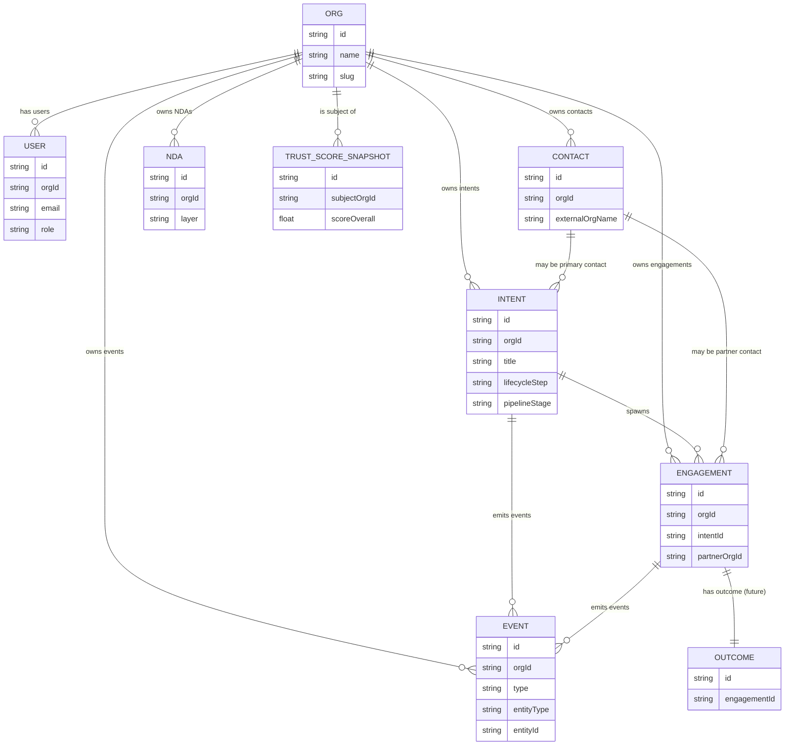

\
# Phase1_MVP-Spec - R1.0 "Intent & Pre-Sales OS for X" v0.3

_Source of truth for this section:_
- GitHub issue #1 - `[M0] Phase1_MVP-Spec - R1.0 Product Spec section`
- Enabion - Playbook v2.3 (2025)
- Enabion - Full Implementation Plan v0.4 (2025)

This document defines the **R1.0 MVP product scope** for Enabion as an **"Intent & Pre-Sales OS for X"**.

It is the **contract between CEO, CTO and dev/AI team** for what we actually implement in R1.0.  
All decisions here are **M0-level** and MUST NOT be left as TBD when designing, coding or configuring AI.

---

## 0. Core domain definitions (X, Y, Z, Intent)

### 0.1 Core actors (R1.0)

- **Company X (Client / Buyer / Commissioning company)**  
  Organisation that owns the business problem, budget and risk.  
  X creates the **Intent**, commissions the work and is explicitly **looking for vendor(s) Y to deliver** the work or program.

- **Company Y (Vendor / Provider / Delivery partner)**  
  Organisation that responds to Intents created by X and proposes/delivers a solution.  
  In R1.0 Y has a minimal value flow: receives Intents from X, qualifies them and responds (interested / not interested + short response).

- **Company Z (Sub-vendor / Sub-contractor)**  
  Additional suppliers engaged by Y inside the same Engagement (X<->Y<->Z...).  
  In R1.0 Z is only a conceptual role (no dedicated UI). We keep the terminology consistent with the Playbook for future phases.

> The same legal entity can act as X in one Engagement and as Y or Z in another,  
> but within a single Engagement roles **X / Y / Z are always clearly separated**.

### 0.2 Intent

**Intent** = structured description of what X wants to achieve by commissioning work to Y (and possibly Y<->Z).  

Minimum semantic definition for R1.0:

- Business objective (what X wants to achieve and why).
- Context (where, for whom, why now).
- Scope (what is in, what is out).
- Assumptions & constraints.
- KPIs & success criteria.
- Risks & unknowns (business, technical, regulatory).
- Basic commercial expectations (budget range, timeframe) - optional but recommended.

Intent is **single source of truth** for the whole pre-sales process in R1.0.

### 0.3 Lifecycle vocabulary (R1.0)

We use the Playbook vocabulary and map it to R1.0:

- Ecosystem path: **CONNECT -> POWER -> GROW**.
- Partnership lifecycle: **Clarify -> Match & Align -> Commit & Assure -> Deliver -> Expand**.
- R1.0 focuses primarily on:
  - Clarify,
  - Match & Align,
  - Commit & Assure (only pre-sales part),
  - plus very light Deliver/Expand as *pipeline statuses only* (no project containers yet).

Pipeline column names in R1.0 mirror the early lifecycle:

- **New -> Clarify -> Match -> Commit -> Won -> Lost**.

`Deliver` and `Expand` exist only as concepts and future phases; they are *not* implemented as full flows in R1.0.

---

## 1. R1.0 Product overview

### 1.1 Product concept

**Working name:** Enabion (placeholder, branding-neutral wording in UI where possible).  
**Release:** **R1.0 - MVP "Intent & Pre-Sales OS for X"**.

R1.0 delivers a narrow but high-impact slice of the full vision:

> A Business Collaboration OS for X that turns messy client emails and RFPs  
> into clear, structured **Intents**, helps BD/AM with **Avatars** (Intent Coach & Organization Avatar),  
> and provides a **pre-sales pipeline** where Clarify -> Match -> Commit decisions are transparent and traceable.

Key R1.0 components:

1. **Intent Engine** - one standard for describing what X wants, usable across all engagements.
2. **Avatars (AI)** - System Avatar, Organization Avatar X, Intent Coach / Brief Scanner.
3. **Matching & basic Y involvement** - minimal yet real value for Y.
4. **Pre-sales pipeline for X** - visual board from New -> Clarify -> Match -> Commit -> Won/Lost.
5. **NDA & confidentiality model** - L1/L2/L3 + NDA layers 0/1 integrated in UX.
6. **Multilingual behavior** - PL/DE/NL markets with EN as default/fallback.

### 1.2 Target customers and scope of R1.0

**ICP X (primary payer):**  

- X = companies that **commission** IT/Tech/Software work and actively look for vendors Y:
  - internal program owners (e.g. AI / NIS2 / Digital),
  - companies with recurring IT/Tech projects and vendor management needs,
  - typical size 5-500 FTE.
- X uses Enabion as OS for Intents and pre-sales with multiple vendors Y.

**ICP Y (secondary, minimal value in R1.0):**

- Vendors / suppliers delivering software / services to X:
  - software houses, agencies, consulting firms, integrators, training providers.
- Y gets:
  - a simple Incoming Intents view and a way to respond.

**Out-of-scope segments R1.0:**

- Public sector and defense in production (can be piloted on Standard data model).
- Full Y-side pipeline OS.
- Hubs features beyond light concept.

---

## 2. Personas (R1.0)

Personas drive UX and copy decisions. All UI/flows must be validated against these four personas.

### 2.1 X-BD/AM (primary persona)

**Role:** Business Development / Account Manager at X (commissioning company).

**Responsibilities:**

- Receive and qualify incoming problems / opportunities from internal stakeholders.
- Turn messy internal/external signals into structured Intents.
- Manage pre-sales interactions with potential vendors Y.
- Maintain relationship with Y during pre-sales and handover to delivery.

**Key goals in R1.0:**

- Cut time from first email/brief to a clear Intent ready for decision or vendor search.
- Reduce chaos in communication with stakeholders and vendors.
- Increase win-rate of good Intents and kill weak ones early.
- Have one place where all potential engagements and invited vendors are visible.

**Main pains today:**

- Poor quality internal "briefs" and external RFPs.
- No standard structure of opportunities.
- Too many tools: email, sheets, PPT, ad-hoc docs.
- Vendor selection partly based on noise / politics, not on structured comparison.

**Definition of success (R1.0):**

- X-BD can paste an email / RFP and within minutes see a clear Intent with missing info and risks listed.
- X-BD can easily invite 1-3 candidate vendors Y and see their responses in one place.
- X-BD can track their Intents in one pipeline and see where they are stuck.

### 2.2 X-CEO / COO / Head of Pre-Sales

**Role:** ultimate decision-maker at X for pre-sales and vendor choice.

**Goals:**

- See a single, up-to-date view of all Intents and pre-sales stages.
- Make better decisions "where we invest pre-sales effort" and "with which vendors".
- Reduce risk of bad vendor choices or badly framed projects.

**Definition of success (R1.0):**

- Can open Pipeline and see all Intents with owner, stage and risk.
- Can drill into any Intent and understand context, assumptions and risks in minutes.
- Can see simple behavioral TrustScore snapshots for X and invited Y.

### 2.3 X-PM (light persona)

**Role:** Project Manager or Delivery Lead at X.

**Goals:**

- Ensure that what was promised in pre-sales is realistic and deliverable.
- Surface risks and constraints early.
- Reduce handover pain from pre-sales to delivery.

**Definition of success (R1.0):**

- For any future project they can review the Intent and comment before final Commit.
- Risks and assumptions are visible, not scattered in mail threads.

### 2.4 Y-BD/AM (minimal persona)

**Role:** BD/AM at Y (vendor) receiving RFP-like Intents from X.

**Goals:**

- Quickly decide if an Intent from X is worth engaging in.
- Answer with minimal effort and see status of their responses.

**Definition of success (R1.0):**

- Y sees all incoming Intents in a simple list with clear titles, deadlines and status.
- Y can mark "interested / not interested" and send a short response without adopting a full OS.
- Y knows whether an Intent is still active or closed.

---

## 3. Information Architecture (R1.0)

### 3.1 Main sections for X

1. **Intents**
   - List of all Intents created by X.
   - Creation and editing of Intents.
   - Entry point to Intent Coach suggestions.

2. **Pipeline**
   - Kanban board: New -> Clarify -> Match -> Commit -> Won -> Lost.
   - Filters for owner, client, language, sector, vendor involvement.

3. **Avatars**
   - Home for AI-assisted workflows (Intent Coach main workspace).
   - System messages and guidance.

4. **Settings**
   - Organization X profile (who we are, what we do).
   - NDA / confidentiality defaults.
   - Language settings.
   - Email integration setup (`intent@org.enabion.com` etc.).

### 3.2 Minimal sections for Y

1. **Incoming Intents**
   - List of Intents sent to Y by X.
   - Status and basic info.

2. **Profile / Settings**
   - Y organization profile (name, domain, sectors, tech, regions, languages).
   - Notification preferences.

### 3.3 Navigation

- Global navigation (left sidebar or top bar) with:
  - Intents
  - Pipeline
  - Avatars
  - Settings
- R1.0 must support:
  - clear "You are acting as organization: [X name]" or "[Y name]" label;
  - ability to switch org for users who are members of multiple orgs (rare in R1.0, but the pattern must exist).

---

## 4. Core user journeys (R1.0)

Each journey below MUST be supported end-to-end in UX, API and AI configuration.

### 4.1 Journey A - X clarifies a messy request into a clear Intent (no Y yet)

**Actors:** X-BD (primary), Intent Coach, optionally X-CEO/COO and X-PM.  
**Start:** X-BD receives an internal or external email/brief about a need.  
**End:** clear Intent in Clarify stage, with identified missing info and risks.

**Steps:**

1. X-BD logs into Enabion as X.
2. Navigates to **Avatars -> Intent Coach**.
3. Pastes raw email / notes / RFP into a single text area.
4. Intent Coach:
   - detects language,
   - parses the text,
   - proposes a structured Intent draft with:
     - title,
     - client / internal sponsor,
     - objective,
     - context,
     - scope,
     - assumptions & constraints,
     - KPIs/success criteria,
     - risks & unknowns,
     - suggested budget and timeline fields (if present).
5. Intent Coach also outputs a list of **"Missing information"** items (checklist).
6. X-BD reviews the draft:
   - edits text fields,
   - removes or adds items,
   - optionally asks Intent Coach to refine wording.
7. X-BD clicks **"Save as Intent"**:
   - system creates Intent with stage = **New**.
8. X-BD opens newly created Intent detail, checks fields, optionally assigns internal owner and tags.
9. Once Intent has minimum required fields (see section 5.3), X-BD moves it to **Clarify** stage.
10. X-CEO/COO and X-PM can review the Intent, add comments, and mark internal "go / no-go for deeper exploration".

**Acceptance criteria:**

- X-BD can go from raw email to a fully structured Intent without leaving the app.
- No manual copying between external tools is required.
- Intent Coach suggestions are visible, accept/reject-able, and logged.

### 4.2 Journey B - X invites Y vendors to respond to an Intent

**Actors:** X-BD, Y-BD, System Avatar, Intent Coach.  
**Start:** Intent is in Clarify stage and has enough information for vendor selection.  
**End:** Y's have responded, X has clear basis for Commit decision.

**Steps:**

1. X-BD opens Intent detail.
2. Goes to **"Vendors / Invitations"** sub-section.
3. Chooses vendors Y to invite:
   - manual input (email/domain),
   - or asking Avatar to suggest Y based on X's preferences (sector, tech, region, language, previous relationships).
4. For each Y, X selects information sharing level:
   - L1 only (No-NDA),
   - or L2 (requires Mutual NDA).
5. System Avatar warns if L2-level content exists but NDA is not active yet.
6. X confirms invitations; system sends:
   - email with link to the Intent portal for Y,
   - and internal notification for X.
7. Y receives email, clicks link:
   - if Y has no account:
     - minimal org + user onboarding (see 9.2),
   - then Y lands on **Incoming Intents** with this Intent open.
8. Y sees:
   - L1 content (and L2 after NDA if required and accepted),
   - due date or "requested response by [date]".
9. Y marks **"Interested"** or **"Not interested"** and may write a short response.
10. X sees all responses per Y in the Intent detail.
11. X moves Intent to **Match** or directly to **Commit**, selects preferred Y (or decides to drop or re-open search).

**Acceptance criteria:**

- X can invite at least 1-3 Y's with correct confidentiality levels.
- Y can respond without needing full OS complexity.
- X can compare Y responses centrally.

### 4.3 Journey C - X uses the Pipeline board for decisions

**Actors:** X-CEO/COO, X-BD.  
**Start:** There are multiple Intents across different stages.  
**End:** management uses Pipeline to monitor and intervene.

**Steps:**

1. X-CEO/COO goes to **Pipeline** section.
2. Sees kanban board with columns:
   - New, Clarify, Match, Commit, Won, Lost.
3. Each card shows:
   - title,
   - client / internal sponsor,
   - owner,
   - days in stage,
   - risk indicator,
   - simple vendor indicator (if invited Y).
4. CEO/COO filters by owner, sector, language, or vendor involvement.
5. CEO/COO clicks any card for details (Intent detail screen).
6. CEO/COO can:
   - request clarifications (via comments),
   - suggest stage changes (e.g. move to Lost),
   - identify stuck Intents (e.g. >X days in Clarify/Match) - optionally highlighted by System Avatar.

**Acceptance criteria:**

- Pipeline is usable as a daily/weekly decision board.
- Stage transitions are consistent between Pipeline and Intent detail.
- Stuck Intents are easily visible.

### 4.4 Journey D - Y receives and manages Incoming Intents

**Actors:** Y-BD, optionally Y-CEO/COO.  
**Start:** Y has been invited by X to view one or more Intents.  
**End:** Y has clearly responded to each relevant Intent (interested/not interested + response).

**Steps:**

1. Y receives email ("X invited you to view an Intent via Enabion").
2. Y clicks link:
   - if new:
     - quick org + user setup (see 9.2),
   - then lands in **Incoming Intents**.
3. Incoming Intents list shows:
   - title,
   - commissioning company X (or safe label if anonymised),
   - brief summary,
   - due date / requested response date,
   - status: Awaiting response, Responded, Closed.
4. Y clicks an Intent:
   - sees L1 content (project summary),
   - sees clarifying questions from X,
   - sees timeline and high-level constraints.
5. Y can:
   - mark **Interested / Not interested**,
   - send a short response (plain text + max N attachments, where N is small and defined for R1.0).
6. Y later sees updated status: Won / Lost / No decision.

**Acceptance criteria:**

- Y can operate entirely from the Incoming Intents panel without using any other part of the app.
- Minimal friction onboarding - no long forms or complex settings required.

---

## 5. Screen specifications (R1.0)

This section describes what dev/UX must implement. It is not pixel-perfect, but is **field-level** and **behavioral**.

### 5.1 Authentication and organization selection

**R1.0 decisions:**

- Authentication:
  - email + password (mandatory),
  - optional magic-link / passwordless may be added if easy, but not required.
- No SSO (AzureAD / Google) in R1.0.
- Organization selection:
  - after login, if user belongs to multiple orgs:
    - show simple org selection screen,
    - persist last chosen org as default for next login.

### 5.2 Intents List (X)

**Route:** `/intents`  

**Purpose:** show all Intents belonging to current X organization.

**Columns (minimum):**

- Title,
- Client/Stakeholder (text label),
- Owner (user at X),
- Stage (New / Clarify / Match / Commit / Won / Lost),
- Last updated (timestamp),
- Language (detected/selected),
- Risk level (Low / Medium / High - from Avatars, optional override).

**Actions:**

- Filter by:
  - Stage (multi-select),
  - Owner,
  - Language,
  - Sector (if present),
  - "Has invited vendors" (yes/no).
- Sort by:
  - Last updated (default),
  - Created date,
  - Stage.
- Button **"New Intent"**:
  - leads to New Intent screen (5.3).

**Empty state:**

- If no Intents:
  - show CTA explaining core use case ("Paste your first email into Intent Coach to create an Intent").

### 5.3 New Intent screen (X)

**Route:** `/intents/new`  

**Key concept:** user chooses **creation mode**, but all modes produce the same Intent structure.

**Layout:**

- Mode selector (radio or tabs):
  1. "Paste email / RFP"
  2. "Manual entry"
  3. "Start with Intent Coach"

- Common Intent fields:
  - Title (string, required before save),
  - Client / internal sponsor (string),
  - Objective (multi-line, required),
  - Context (multi-line),
  - Scope - what's in (multi-line),
  - Scope - what's out (multi-line, optional),
  - Assumptions & constraints (multi-line),
  - KPIs / success criteria (multi-line),
  - Risks & unknowns (multi-line),
  - Budget range (string or numeric range, optional),
  - Expected timeline (string, optional),
  - Preferred languages (multi-select: PL, DE, NL, EN),
  - Sector / industry (tags),
  - Technologies (tags),
  - Confidentiality level (L1/L2 toggle, default L1).

**Mode behavior:**

1. **Paste email / RFP**
   - Input area: "Paste email / RFP text".
   - Button: "Let Intent Coach draft Intent".
   - After click:
     - call AI with pasted text,
     - populate common fields with AI output,
     - show highlight of which fields are AI-filled vs empty,
     - show "Missing information" checklist.

2. **Manual entry**
   - All fields visible and editable from start.
   - Button: "Ask Intent Coach to review".
   - After click:
     - AI analyses fields,
     - returns suggestions as cards: "Add KPI", "Clarify scope", etc.

3. **Start with Intent Coach**
   - Instead of form, show conversational pane:
     - Avatar asks guided questions step by step.
   - At the end:
     - user previews a full Intent form pre-populated,
     - can edit before saving.

**Save behavior:**

- First save:
  - stage = **New**,
  - missing required fields:
    - Title and Objective are required to save.
- UI must provide clear error messages if required fields empty.

### 5.4 Intent Detail (X)

**Route:** `/intents/:id`  

**Purpose:** single source of truth for a given Intent.

**Header:**

- Title,
- Stage (badge, with color),
- Commissioning company / internal sponsor label,
- Owner at X,
- Language,
- Current confidentiality summary (e.g. "L1 only", "L1+L2 (Mutual NDA active)"),
- Simple TrustScore badge (for X and invited Y, if any).

**Tabs/sections:**

1. **Overview**
   - read-only view of all key fields (title, objective, context, scope, KPIs, risks, etc.),
   - "download as PDF" optional but not required for R1.0.

2. **Details**
   - editable form of all Intent fields,
   - stage-independent (fields always editable, but some changes may warn if stage >= Commit).

3. **AI Suggestions**
   - list of suggestions from Intent Coach and Organization Avatar X:
     - each suggestion:
       - category (Missing info / Risk / Scope / KPIs / Wording / Other),
       - short description,
       - proposed change,
       - actions: Accept / Reject.
   - Accept:
     - applies changes to relevant fields, marks suggestion as accepted.
   - Reject:
     - marks suggestion as rejected (kept for audit, but visually de-emphasised).

4. **Activity**
   - chronological list of events:
     - Intent created,
     - fields updated (aggregated, not every keystroke),
     - stage changes,
     - AI suggestions issued/accepted/rejected,
     - vendor invitations sent,
     - Y responses received,
     - NDA status changes.

5. **Vendors / Invitations**
   - see section 5.5.

### 5.5 Vendors / Invitations sub-section (X)

**Location:**

- Inside Intent detail, either:
  - a dedicated tab, or
  - a prominent panel within Overview/Details.

**Data:**

- List of invited vendors Y:
  - Y org name (or email/domain if not yet onboarded),
  - status:
    - Pending invite,
    - Invite sent,
    - Viewed,
    - Responded,
    - Declined,
    - Closed (Won/Lost).
  - Information level:
    - L1 only,
    - L1/L2 (if NDA active).
  - Simple TrustScore for Y (if available).

**Actions:**

- "Invite vendor":
  - input email or domain,
  - optional selection from previously used vendors,
  - selection of information level (L1 or L2).
- "Resend invite".
- "Change info level":
  - L1 -> L1/L2:
    - only allowed if NDA between X and Y is active (Mutual NDA).
- "View response":
  - opens Y's response in read-only mode.

### 5.6 Pipeline Board (X)

**Route:** `/pipeline`  

**Columns:**

- New,
- Clarify,
- Match,
- Commit,
- Won,
- Lost.

**Cards:**

- Title,
- Client / sponsor,
- Owner,
- Days in stage,
- Risk badge (Low/Medium/High),
- Vendor indicator (e.g. number of invited Y's).

**Interactions:**

- Drag-and-drop between columns:
  - with confirm dialogs for sensitive moves:
    - Move to Won: "Are you sure you want to mark this Intent as Won>="
    - Move to Lost: "Provide optional reason (free text)".
- Stage change from Intent detail must update board and vice versa.

### 5.7 Avatars workspace

**Route:** `/avatars`  

**Sections:**

1. **Intent Coach workspace**
   - large text input area:
     - placeholder: "Paste an email, brief or notes here..."
   - conversation pane with Intent Coach:
     - user messages,
     - avatar responses.
   - actions:
     - "Draft new Intent from this conversation" -> opens New Intent form with fields pre-filled.
     - "Update existing Intent" -> select Intent and apply changes.

2. **System Avatar notifications (optional in R1.0)**
   - list of short messages:
     - e.g. "3 Intents have been in Clarify for more than 14 days".

Focus for R1.0 is **Intent Coach**. More advanced avatar management is future work.

### 5.8 Incoming Intents (Y)

**Route:** `/incoming-intents` (when logged in as Y)  

**List view:**

- Columns:
  - Title,
  - Commissioning company X (or anonymised label),
  - Summary (1-2 lines),
  - Requested response date,
  - Status:
    - Awaiting response,
    - Responded,
    - Closed (Won/Lost).
- Filters:
  - by status,
  - by date.

**Detail view:**

- Title, X label, context summary.
- Main fields from Intent that Y can see:
  - For L1:
    - high-level objective,
    - high-level context,
    - high-level scope,
    - timeline and budget in broad terms (if present),
    - questions from X.
  - For L2 (after NDA accepted):
    - deeper scope details,
    - constraints and sensitive business information.
- Actions:
  - mark **Interested / Not interested** (single-choice),
  - write a short response (multi-line),
  - upload optional attachment (max size and types defined in tech spec),
  - submit.

---

## 6. NDA & confidentiality model in UX (R1.0)

### 6.1 Levels L1 / L2 / L3

**Definitions:**

- **L1 - public / matching**
  - Safe to share without NDA.
  - High-level description suitable for conference talk.
- **L2 - confidential / NDA**
  - Requires NDA.
  - Deeper context, internal processes, some architecture, but no critical IP/PII in R1.0.
- **L3 - deep confidential**
  - Critical IP, PII, defense, etc.
  - R1.0: conceptual only (no dedicated flows).

**UX requirements:**

- Each Intent has a **max confidentiality level** indicator in header:
  - "Max level: L1 only" or "Max level: L1/L2 enabled".
- When user writes obviously L2-style content while max level is L1 only:
  - System Avatar warns the user.
- L3 appears in UX only as a disabled or "future" marker; there is no actual L3 content handling in R1.0.

### 6.2 NDA layers 0/1 (R1.0 scope)

R1.0 implements:

- **Layer 0 - No-NDA Zone**
  - Default for all new orgs and Intents.
  - Safe for L1 data only.
- **Layer 1 - Enabion Mutual NDA**
  - Ecosystem-wide mutual NDA for pre-sales.
  - Accepted once per organization and reused.

**UX flow - X side:**

1. X admin or first user goes to Settings -> NDA.
2. Sees explanation:
   - No-NDA Zone,
   - Mutual NDA benefits,
   - basic summary of legal effect.
3. If X accepts Mutual NDA:
   - clicks checkbox and "Accept Mutual NDA".
   - System records NDA active status.
4. When creating or editing an Intent:
   - if X wants to include L2 info or share L2 with Y, Mutual NDA must be active (or L2 sharing disabled).

**UX flow - Y side:**

1. When Y is invited to an L2 Intent:
   - Y sees a notice:
     - "To see L2 details you must accept Mutual NDA".
2. After acceptance:
   - Y can access L2 content for Intents with that X.
   - L2 content still respects L1/L2 boundaries (not all fields have to be L2).

---

## 7. Intent creation modes (implementation detail)

R1.0 MUST support all three modes as first-class citizen flows.

### 7.1 Mode 1 - Start with Intent Coach (conversation-first)

- User interacts with Intent Coach only.
- Intent Coach dynamically collects:
  - business objective,
  - context,
  - scope,
  - constraints,
  - KPIs,
  - risks.
- At any time user can say:
  - "I think this is enough, create an Intent".
- System shows preview Intent:
  - user can edit fields and then save as normal Intent.

### 7.2 Mode 2 - Manual form + review

- User fills standard Intent form by hand.
- Clicks "Ask Intent Coach to review".
- Intent Coach responds with:
  - summary of understanding,
  - list of missing information,
  - list of suggested improvements.
- Suggestions appear in AI Suggestions tab as "cards" that can be accepted or rejected.

### 7.3 Mode 3 - Paste email / brief

- User chooses "Paste email / RFP" mode.
- Pastes content.
- Intent Coach:
  - extracts key elements,
  - maps them into Intent fields,
  - flags contradictions and unclear parts,
  - produces clarifying questions list.

### 7.4 Event logging (high-level)

For R1.0, every AI interaction leading to Intent creation or modification must create at least one event:

- `AVATAR_SUGGESTION_ISSUED`
- `AVATAR_SUGGESTION_ACCEPTED`
- `AVATAR_SUGGESTION_REJECTED`
- `INTENT_CREATED`
- `INTENT_UPDATED`

Exact event schema will be defined in **BCOS Data & Event Model v1**; this spec is just naming expectations.

---

## 8. Avatars (product behavior in R1.0)

### 8.1 System Avatar

System Avatar is an OS-level guide:

- Explains concepts:
  - Intent,
  - lifecycle,
  - NDA layers,
  - L1/L2/L3.
- Notifies users about:
  - stuck Intents (e.g. too long in Clarify),
  - missing mandatory fields before stage changes,
  - potential confidentiality mismatches (L2 data in L1-only Intent).

### 8.2 Organization Avatar X

Organization Avatar X:

- Knows X's:
  - sectors, technologies, geographies,
  - typical project sizes,
  - risk appetite.
- Helps X-BD/AM decide:
  - if an Intent fits X's strategy,
  - how to prioritise Intents.

In R1.0, Org Avatar behavior is exposed via:

- suggestions in AI Suggestions tab,
- messages in Intent Coach (when user asks "does this fit us>=").

### 8.3 Intent Coach / Brief Scanner

Core R1.0 avatar:

- Responsibilities:
  - parse free-form input (emails, briefs),
  - generate structured Intents,
  - highlight missing information,
  - propose questions and risks,
  - review manually entered Intents.

Quality rules:

- Must be able to answer "I don't know / I need more information" instead of hallucinating.
- Must not invent non-existent clients, projects or credentials.

### 8.4 Guardrails visible to users

- Every suggestion has Accept / Reject.
- No automated stage changes based solely on AI suggestions.
- Avatars do not automatically invite vendors Y or accept NDA.

---

## 9. Languages & localization

### 9.1 Supported languages in R1.0

R1.0 supports:

- UI languages:
  - Polish (PL),
  - German (DE),
  - Dutch (NL),
  - English (EN).
- Avatars:
  - must understand and generate PL/DE/NL/EN.
  - default to EN when detection fails or user explicitly selects EN.

### 9.2 Language behavior

- On first login:
  - UI language defaults based on browser language if in {PL, DE, NL},
  - otherwise EN.
- User can change UI language in Settings.
- When user pastes email:
  - system attempts to auto-detect language,
  - sets Intent language accordingly,
  - uses this language for Avatar outputs,
  - user can override language if detection is wrong.
- Unsupported language input:
  - Avatar replies in EN and warns that language is not fully supported.

---

## 10. Minimal Y value & flow

### 10.1 Y onboarding (minimal)

- Required organization fields:
  - Name,
  - Domain,
  - Sector(s),
  - Technologies,
  - Regions,
  - Preferred languages.
- Required user fields:
  - Name,
  - Email,
  - Role.
- Y must accept basic terms and privacy; Mutual NDA is optional until L2 Intents appear.

### 10.2 Minimal Y operations

Y can:

- See Incoming Intents list.
- Filter by status and date.
- Open any Intent they were invited to.
- Mark Interested / Not interested.
- Send a short text response and (optionally) one attachment.
- See final status (Won / Lost / No decision).

No Y-side pipeline, no advanced analytics, no Hubs UI in R1.0.

---

## 11. TrustScore MVP (R1.0)

### 11.1 Purpose and scope
 
TrustScore MVP:
 
Reference: docs/trust/TrustScore_TrustGraph_Methodology_v0.md (Issue #10).

  - visible numeric and qualitative indicator,
  - based primarily on **behavior** in R1.0,
  - not yet on historical projects or Hubs.

### 11.2 Scale

- 0-100, but interpreted with strong default neutrality:
  - new orgs: 50 = "New / No history yet".
- Score shifts away from 50 based on behavior only.

### 11.3 Signals in R1.0

- Profile completeness (org and user).
- Responsiveness:
  - average time to respond to Intents (as X and Y).
- Engagement:
  - number of Intents created and responded (normalized).
- NDA readiness:
  - acceptance and use of Mutual NDA for pre-sales.
- No ODR / Hubs / financial behavior included yet.

### 11.4 UX placement

- Organization-level summary:
  - Settings -> Organization -> TrustScore panel.
- Intent-level:
  - header badges:
    - X TrustScore,
    - Y TrustScore (for each invited vendor).

---

## 12. Telemetry & metrics (R1.0)

R1.0 must emit events and metrics to support:

- product iteration,
- future TrustScore/TrustGraph,
- business reporting.

### 12.1 Minimal metric set

At minimum:

- # of organizations (X and Y).
- # of active users.
- # of Intents created per org and per month.
- Time:
  - email paste -> first Intent saved,
  - Intent creation -> Clarify,
  - Clarify -> Commit.
- Conversion rates:
  - Intent -> Commit,
  - Commit -> Won.
- Avatar usage:
  - # of AI suggestions per Intent,
  - % suggestions accepted, rejected.

### 12.2 Event names (high-level)

The following events MUST exist in event model (actual schema in Data & Event Model doc):

- `INTENT_CREATED`
- `INTENT_UPDATED`
- `INTENT_STAGE_CHANGED`
- `INTENT_INVITATION_SENT`
- `Y_RESPONSE_SUBMITTED`
- `NDA_MUTUAL_ACCEPTED`
- `AVATAR_SUGGESTION_ISSUED`
- `AVATAR_SUGGESTION_ACCEPTED`
- `AVATAR_SUGGESTION_REJECTED`

No `ISSUE_*` or `DISPUTE_*` events in R1.0 (they start in R2.0).

---

## 13. Edge cases & error handling

R1.0 must support at least:

1. **Intent with almost no data**
   - On save:
     - require Title + Objective,
     - warn user if moving beyond New with empty critical fields (scope, KPIs, risks).

2. **Language unsupported**
   - If detection fails or language outside PL/DE/NL/EN:
     - Avatar responds in EN,
     - displays banner about language limitations.

3. **Duplicate Intents**
   - When creating new Intent from email:
     - if another Intent exists with very similar content (heuristic),
     - show suggestion: "This looks similar to [Intent X]; merge or continue>=".

4. **NDA not accepted but L2 selected**
   - If user tries to share L2 with Y without Mutual NDA:
     - block action with clear message:
       - "You must activate Mutual NDA or downgrade to L1 content."

5. **Avatar "I don't know"**
   - When input is too short or conflicting:
     - Avatar must explicitly say "I don't know / I need more information",
     - propose concrete questions to ask the client/internal sponsor.

6. **Vendor not responding**
   - For Intents in Match where Y did not respond by due date:
     - System Avatar can suggest:
       - send reminder,
       - close Y as "no response",
       - search for alternative Y.

7. **Deleted/archived Intents**
   - R1.0 behavior:
     - soft delete only,
     - removed from active lists,
     - still present in event log, with "archived" marker.

---

## 14. Out-of-scope for R1.0

Explicitly NOT included:

1. Central Organisation Dashboard with full Clarify/Match/Commit/Deliver/Expand panels.
2. Full BCOS project containers / Trust Rooms with execution phase (Deliver & Expand flows).
3. Full OS for Y (Y-side pipeline, multi-seat Y governance).
4. Hubs UI and governance features.
5. ODR module (Issues/Disputes workflows).
6. Financial layer (escrow, milestone payments, Financial TrustScore).
7. Complex AI governance UI (we implement guardrails, but not full configuration consoles).
8. BigTech / Big5 integrations beyond email-level forwarding (no deep CRM/Teams/Jira integrations).
9. Advanced multi-jurisdictional data retention interfaces (we stick to basic EU-compliant defaults).

---

## 15. Acceptance criteria for this spec (R1.0 section)

From CTO/CEO perspective, this **R1.0 section** of `Phase1_MVP-Spec` is **Done** when:

1. All elements in this document are implemented in R1.0 UI, backend and AI configuration OR explicitly postponed in a newer version of this spec.
2. There are no open TBDs for:
   - personas,
   - core journeys,
   - R1.0 screens & IA,
   - NDA/L1/L2 behavior,
   - Intent creation modes,
   - minimal Y flow,
   - TrustScore MVP visibility,
   - telemetry and events.
3. Implementation aligns with Enabion Playbook v2.3 and Implementation Plan v0.4 (no contradictions in domain language).
4. CEO and CTO have reviewed a working build and signed off that:
   - the product actually behaves as described here,
   - any deviation is documented and reflected in an updated spec.

This spec is the single source of truth for R1.0 scope.  
Any change to R1.0 behavior must either:
- be implemented exactly as described here, or
- trigger an explicit spec update and sign-off.

---

## 16. BCOS Data & Event Model v1 (MVP)
_Detailed standalone doc: `docs/BCOS_Data_Event_Model_v1.md` (Issue #2)._

### 16.1 Goals and design principles

**Goal**

Provide a single, canonical **BCOS Data & Event Model v1** for R1.0 that:

1. Aligns with the Enabion Playbook (CONNECT-POWER-GROW and the 5-Step Partnership Lifecycle).   
2. Covers all R1.0 pre-sales flows: **Intent -> Avatars -> Match -> NDA -> Commit**.   
3. Is **multi-tenant, RBAC-aware and event-sourced** from day one.  
4. Is forward-compatible with R2.0+ (Deliver, Issues/Disputes, Outcome, TrustGraph, Models 2-3).  

**Design principles**

- **Protocol-first** - every meaningful change in the system must be representable as a BCOS event.  
- **Minimal but complete** - only entities required for R1.0 are implemented, but their shapes anticipate R2.0+.  
- **Multi-tenant by default** - every domain record is scoped to an organisation (tenant) and later extendable to multi-party engagements.  
- **RBAC-aware** - the model encodes the roles and access patterns required for R1.0 (Owner, Manager, Contributor, Viewer).   
- **Clear migration path** - evolving from R1.0 to later releases should not require breaking schema changes.

---

### 16.2 Core entities - overview

R1.0 uses the following core entities (Model 1 - Standard):   

1. **Org** - Enabion organisation account (tenant) representing a company X or Y.  
2. **User** - a person belonging to an Org (BD/AM, PM, CEO, etc.).  
3. **Contact** - business contact related to an Intent or Engagement (mostly external to the Org).  
4. **Intent** - structured representation of a business need from firm X; single source of truth for pre-sales.   
5. **Engagement (pre-sales)** - X↔Y relationship in the pre-sales phase for a given Intent (e.g. "X ↔ BrightCode for Intent #123").   
6. **NDA** - representation of NDA status between parties (focus on Layer 0 and Layer 1 in R1.0).   
7. **Event** - canonical event log entry (Enabion Event Model / protocol of events).   
8. **TrustScoreSnapshot** - snapshot of a simple behavioural TrustScore (MVP).   
9. **Outcome (skeleton)** - future entity for delivery outcomes; shape defined now, not used in R1.0.   

These entities are sufficient to:

- manage Intents and pre-sales pipeline for X,  
- log Avatar work and human decisions as events,  
- track NDA status at pre-sales level,  
- compute a minimal behavioural TrustScore.

---

### 16.3 Cross-cutting technical fields

All domain entities share the following **technical / audit fields** (not repeated in each table):

- `id` - ULID string, primary key (e.g. `org_01HZX...`, `intent_01HZX...`).  
- `createdAt` - timestamp (UTC).  
- `updatedAt` - timestamp (UTC).  
- `createdByUserId` - ULID of the user who created the record (nullable for system-created records).  
- `updatedByUserId` - ULID of the user who last updated the record.  
- `orgId` - ULID of the owning Org (tenant) unless explicitly stated otherwise.  

For R1.0 we **do not** implement soft-delete at the entity level. Deletion rules (incl. "right to be forgotten") will be handled in a separate policy and release (R2.0+).

---

### 16.4 Entity definitions

#### 16.4.1 Org (Organisation)

Represents an Enabion tenant (firm X or Y; in some cases both).

| Field              | Type     | Required | Description |
|--------------------|----------|----------|-------------|
| `name`             | string   | yes      | Legal / public name of the organisation. |
| `slug`             | string   | yes      | URL-friendly identifier, unique in the system (e.g. `brightcode`). |
| `orgType`          | enum     | yes      | `X`, `Y`, `BOTH`, `HUB`, used mainly for analytics and UX. |
| `defaultLocale`    | string   | yes      | Default locale code (e.g. `pl-PL`, `de-DE`, `nl-NL`, `en-GB`). |
| `supportedLocales` | string[] | yes      | Locales the org wants to use for UX and Avatars. |
| `defaultCurrency`  | string   | yes      | 3-letter ISO currency code (e.g. `EUR`). |
| `country`          | string   | yes      | ISO country code of HQ (e.g. `PL`, `DE`, `NL`). |
| `timeZone`         | string   | yes      | IANA time zone (e.g. `Europe/Warsaw`). |
| `sizeBand`         | enum     | no       | Approximate size (e.g. `1-10`, `11-50`, `51-200`, `200+`). |
| `status`           | enum     | yes      | `invited`, `active`, `trial`, `suspended`. |
| `trustScoreLatestId` | ULID   | no       | FK to latest `TrustScoreSnapshot` for quick access. |

#### 16.4.2 User

User account belonging to exactly one Org.

| Field         | Type   | Required | Description |
|---------------|--------|----------|-------------|
| `orgId`       | ULID   | yes      | Owning organisation. |
| `email`       | string | yes      | Unique email within the system. |
| `fullName`    | string | yes      | Display name. |
| `role`        | enum   | yes      | `OWNER`, `MANAGER`, `CONTRIBUTOR`, `VIEWER`. |
| `locale`      | string | no       | Preferred locale (overrides `Org.defaultLocale`). |
| `timeZone`    | string | no       | Preferred time zone. |
| `status`      | enum   | yes      | `invited`, `active`, `disabled`. |

R1.0 RBAC:

- `OWNER` - full admin, can manage org settings and billing.  
- `MANAGER` - can see and edit all Intents for the org.  
- `CONTRIBUTOR` - can create/edit Intents they own, see others as configured.  
- `VIEWER` - read-only access to selected views (e.g. CEO).   

#### 16.4.3 Contact

Business contact (usually external) related to an Intent or Engagement.

| Field              | Type   | Required | Description |
|--------------------|--------|----------|-------------|
| `orgId`            | ULID   | yes      | Org that owns this contact (usually X or Y). |
| `externalOrgName`  | string | no       | Name of the external company (client/partner). |
| `externalOrgDomain`| string | no       | Domain of the external org (e.g. `acme.com`). |
| `fullName`         | string | yes      | Name of the contact person. |
| `jobTitle`         | string | no       | Role/position at the external org. |
| `email`            | string | yes      | Contact email. |
| `phone`            | string | no       | Contact phone. |
| `locale`           | string | no       | Contact's preferred language. |
| `type`             | enum   | yes      | `CLIENT_CONTACT`, `PARTNER_CONTACT`, `INTERNAL_STAKEHOLDER`. |
| `notes`            | text   | no       | Free-text notes visible only to owning Org. |

R1.0 uses `Contact` mainly to:

- attach named people to `Intent` (e.g. "client sponsor"),  
- attach named people to `Engagement` (e.g. "partner BD contact").

#### 16.4.4 Intent

Central entity in R1.0 - structured representation of a business need.

| Field                    | Type     | Required | Description |
|--------------------------|----------|----------|-------------|
| `orgId`                  | ULID     | yes      | Owning Org (firm X in R1.0). |
| `title`                  | string   | yes      | Human-readable title of the Intent. |
| `shortCode`             | string   | no       | Short identifier for human use (e.g. `INT-2025-0012`). |
| `rawInputChannel`        | enum     | yes      | `email_forward`, `manual`, `import`. |
| `rawInputReference`      | string   | no       | Reference to original email / system (e.g. message-id). |
| `summary`                | text     | yes      | Concise description generated/curated by Avatar + human. |
| `goal`                   | text     | yes      | What X wants to achieve (business goal). |
| `context`                | text     | yes      | Background, constraints, stakeholders. |
| `scopeSummary`           | text     | yes      | High-level scope (what is in / out). |
| `assumptions`            | text     | no       | Business/technical assumptions. |
| `constraints`            | text     | no       | Constraints (budget, timeline, tech, regulatory). |
| `successMetrics`         | text     | no       | Target KPIs or success metrics. |
| `riskSummary`            | text     | no       | Key risks identified so far. |
| `riskLevel`              | enum     | no       | `NONE`, `LOW`, `MEDIUM`, `HIGH`, `CRITICAL`. |
| `sector`                 | string   | no       | Sector / industry classification. |
| `subSector`              | string   | no       | Optional sub-sector. |
| `tags`                   | string[] | no       | Free-form tags for matching and analytics. |
| `languages`              | string[] | yes      | Languages relevant for the project (e.g. `["de", "en"]`). |
| `budgetMin`              | number   | no       | Minimum expected budget (nullable). |
| `budgetMax`              | number   | no       | Maximum expected budget (nullable). |
| `budgetCurrency`         | string   | no       | 3-letter currency for the budget range. |
| `expectedStartDate`      | date     | no       | Earliest desired project start date. |
| `expectedEndDate`        | date     | no       | Target end date (if known). |
| `confidentialityLevel`   | enum     | yes      | `L1`, `L2`, `L3` (L1/L2 used in R1.0; L3 is placeholder).   |
| `ndaLayerRequired`       | enum     | yes      | `LAYER_0`, `LAYER_1`, `LAYER_2`, `LAYER_3` (R1.0: `LAYER_0`, `LAYER_1` only).   |
| `lifecycleStep`          | enum     | yes      | One of: `CLARIFY`, `MATCH_ALIGN`, `COMMIT_ASSURE`, `DELIVER`, `EXPAND`. R1.0 uses first three functionally. |
| `pipelineStage`          | enum     | yes      | `NEW`, `IN_CLARIFY`, `IN_MATCH`, `IN_COMMIT`, `CLOSED_WON`, `CLOSED_LOST`, `CANCELLED`. |
| `ownerUserId`            | ULID     | yes      | Primary BD/AM responsible for the Intent. |
| `primaryContactId`       | ULID     | no       | FK to main `Contact` on the client side. |
| `avatarQualityScore`     | number   | no       | Internal metric of Avatar fit/completeness (0-100). |

The **Intent** acts as the "project container" for R1.0 (pre-sales only). Full BCOS container appears in R2.0+.

#### 16.4.5 Engagement (pre-sales)

Represents a single **X ↔ candidate Y** relation for a given Intent in pre-sales.

| Field                    | Type   | Required | Description |
|--------------------------|--------|----------|-------------|
| `orgId`                  | ULID   | yes      | Owning Org (X) in R1.0. |
| `intentId`               | ULID   | yes      | FK to `Intent`. |
| `partnerOrgId`           | ULID   | no       | FK to Org of Y if Y has an account in Enabion. |
| `partnerDisplayName`     | string | yes      | Name of Y as seen by X (used if `partnerOrgId` is null). |
| `partnerPrimaryContactId`| ULID   | no       | FK to `Contact` representing BD/contact at Y. |
| `matchScore`             | number | no       | 0-100 score produced by matching engine. |
| `matchReasonSummary`     | text   | no       | Human-readable explanation of the match. |
| `stage`                  | enum   | yes      | `NEW`, `INVITED`, `RESPONDED`, `SHORTLISTED`, `SELECTED`, `NOT_SELECTED`, `WITHDRAWN`. |
| `commitDecision`         | enum   | no       | `UNDECIDED`, `GO`, `NO_GO`. |
| `commitDecidedAt`        | ts     | no       | When the decision was taken. |
| `commitDecidedByUserId`  | ULID   | no       | Who took the decision on X side. |

In R1.0, `Engagement` records are visible only to the owning X. Y-side pipelines will be modelled in R2.0+.

#### 16.4.6 NDA

Represents NDA status between the owning Org and a counterparty.

| Field                  | Type   | Required | Description |
|------------------------|--------|----------|-------------|
| `orgId`                | ULID   | yes      | Primary Org (X or Y) in whose tenant the NDA is stored. |
| `counterpartyOrgId`    | ULID   | no       | Org of the counterparty if known. |
| `counterpartyName`     | string | no       | Free-text name of the counterparty if `counterpartyOrgId` is null. |
| `layer`                | enum   | yes      | `LAYER_0`, `LAYER_1`, `LAYER_2`, `LAYER_3` (R1.0 uses 0/1).   |
| `status`               | enum   | yes      | `draft`, `active`, `expired`, `revoked`. |
| `signedAt`             | ts     | no       | When the NDA became effective. |
| `validFrom`            | ts     | no       | Start of validity period. |
| `validUntil`           | ts     | no       | End of validity period (nullable for "until revoked"). |
| `referenceDocumentUrl` | string | no       | URL or identifier of the actual NDA document (Enabion Mutual NDA or external). |

In R1.0:

- Layer 0 (No-NDA Zone) is the default.  
- Layer 1 (Enabion Mutual NDA) becomes `status = active` once both parties accept the standard NDA in UI.   

Layer 2/3 NDAs are designed but not created/managed via UI yet.

#### 16.4.7 Event

Canonical event log entry for the Enabion Event Model / protocol of events.   

| Field            | Type   | Required | Description |
|------------------|--------|----------|-------------|
| `id`             | ULID   | yes      | Event ID (also `eventId` in envelope). |
| `orgId`          | ULID   | yes      | Org for which the event is stored (tenant). |
| `type`           | string | yes      | Event type (e.g. `INTENT_CREATED`). |
| `schemaVersion`  | int    | yes      | Version of the event payload schema (R1.0: `1`). |
| `occurredAt`     | ts     | yes      | When the event happened in business time. |
| `recordedAt`     | ts     | yes      | When the event was persisted (may differ from `occurredAt`). |
| `actorUserId`    | ULID   | no       | User who caused the event (null for system events). |
| `actorOrgId`     | ULID   | no       | Org on whose behalf the event happened (useful for multi-party). |
| `entityType`     | enum   | yes      | `ORG`, `USER`, `CONTACT`, `INTENT`, `ENGAGEMENT`, `NDA`, `TRUST_SCORE`, `OUTCOME`, `SYSTEM`. |
| `entityId`       | ULID   | yes      | ID of the primary entity the event refers to. |
| `lifecycleStep`  | enum   | no       | Snapshot of 5-Step at the time (same enum as `Intent.lifecycleStep`). |
| `phase`          | enum   | no       | `CONNECT`, `POWER`, `GROW` as derived from lifecycle step. |
| `correlationId`  | ULID   | no       | ID used to group related events (e.g. one user action). |
| `causationId`    | ULID   | no       | ID of the event that directly caused this one (for replay/debug). |
| `payload`        | json   | no       | Event-specific structured payload. |
| `metadata`       | json   | no       | Additional non-critical metadata (client, IP, debug info). |

R1.0 must log at least:

- all `INTENT_*` events,  
- all `AVATAR_SUGGESTION_*` events,  
- `MATCH_LIST_CREATED`,  
- `NDA_ACCEPTED`,  
- `COMMIT_DECISION_TAKEN`.   

#### 16.4.8 TrustScoreSnapshot

Lightweight, behavioural TrustScore snapshot for R1.0. fileciteturn0file2turn0file3  

| Field              | Type   | Required | Description |
|--------------------|--------|----------|-------------|
| `subjectOrgId`     | ULID   | yes      | Org being scored. |
| `scope`            | enum   | yes      | `GLOBAL` (R1.0 only) - later can include sector/region scopes. |
| `scoreOverall`     | number | yes      | 0-100 overall score. |
| `scoreProfile`     | number | no       | 0-100 - profile completeness/quality. |
| `scoreResponsiveness` | number | no    | 0-100 - speed & reliability of responses in pre-sales. |
| `scoreBehaviour`   | number | no       | 0-100 - behaviour in communication (e.g. cancellations, ghosting). |
| `computedAt`       | ts     | yes      | When this snapshot was computed. |
| `algorithmVersion` | string | yes      | Identifier of the computation method (e.g. `trustscore_mvp_v1`). |

In R1.0, TrustScore uses only behavioural and profile signals, **not project outcomes** yet.

#### 16.4.9 Outcome (skeleton, R2.0+)

Represents the result of an Engagement (Deliver + Expand). Not used by R1.0 logic, but the shape is fixed now for forward compatibility. fileciteturn0file2turn0file3  

| Field              | Type   | Required | Description |
|--------------------|--------|----------|-------------|
| `engagementId`     | ULID   | yes      | FK to `Engagement`. |
| `orgId`            | ULID   | yes      | Owning org for this Outcome record (e.g. X or Y). |
| `summary`          | text   | yes      | Short natural-language summary of the outcome. |
| `kpiSummary`       | json   | no       | Structured KPIs (target vs actual). |
| `ratingByX`        | int    | no       | 1-10 rating given by X. |
| `ratingByY`        | int    | no       | 1-10 rating given by Y. |
| `recommendationFlag` | enum | no       | `RECOMMEND`, `NEUTRAL`, `DO_NOT_RECOMMEND`. |
| `createdAt`        | ts     | yes      | When the Outcome was recorded. |

R1.0:

- **does not create or use `Outcome` records**,  
- can still reference the entity in API types to avoid breaking changes later.

---

### 16.5 Event model - envelope and semantics

#### 16.5.1 Event envelope

All BCOS events share a common envelope mapped 1:1 to the `Event` table:

```jsonc
{
  "eventId": "evt_01J0XYZ...",
  "orgId": "org_01J0ABC...",
  "type": "INTENT_CREATED",
  "schemaVersion": 1,
  "occurredAt": "2025-12-10T12:34:56Z",
  "recordedAt": "2025-12-10T12:34:57Z",
  "actorUserId": "usr_01J0...",
  "actorOrgId": "org_01J0ABC...",
  "entityType": "INTENT",
  "entityId": "intent_01J0...",
  "lifecycleStep": "CLARIFY",
  "phase": "CONNECT",
  "correlationId": "evt_01J0CORR...",
  "causationId": "evt_01J0CAUSE...",
  "payload": { /* event-specific */ },
  "metadata": {
    "clientVersion": "web-1.0.0",
    "ip": "203.0.113.1"
  }
}
```

Rules:

- `orgId` is always the **tenant** in which the event is stored.  
- `actorOrgId` may differ when modelling multi-party flows in R2.0+; in R1.0 they are usually equal.  
- `payload` must only contain data required to understand and replay the event; avoid duplication of entire entities when not needed.

#### 16.5.2 Event catalogue (R1.0)

R1.0 requires the following event types:

| Event type                      | Primary entity | Description |
|---------------------------------|----------------|-------------|
| `INTENT_CREATED`                | `INTENT`       | New Intent created (from mail/manual/import). |
| `INTENT_UPDATED`                | `INTENT`       | Intent fields changed (goal, scope, etc.). |
| `AVATAR_SUGGESTION_ISSUED`      | `INTENT`       | Avatar proposed changes/questions on an Intent. |
| `AVATAR_SUGGESTION_ACCEPTED`    | `INTENT`       | User accepted Avatar suggestion (fully or partially). |
| `AVATAR_SUGGESTION_REJECTED`    | `INTENT`       | User rejected Avatar suggestion. |
| `MATCH_LIST_CREATED`            | `INTENT`       | Matching engine produced/updated candidate Y list. |
| `NDA_ACCEPTED`                  | `NDA`/`INTENT` | Parties accepted an NDA relevant for this Intent/Engagement. |
| `COMMIT_DECISION_TAKEN`         | `ENGAGEMENT`   | X made a GO/NO-GO decision for a given X↔Y Engagement. |

Additional system events recommended (not exhaustive):

- `ORG_CREATED`, `USER_INVITED`, `USER_ACTIVATED`  
- `ENGAGEMENT_CREATED`, `ENGAGEMENT_STAGE_CHANGED`  
These follow the same envelope but are not the core of issue #2.

#### 16.5.3 Event -> lifecycle mapping

Mapping of R1.0 events to the 5-Step Partnership Lifecycle and CONNECT-POWER-GROW:

| Event type                   | Step (5-Step)    | Phase (C/P/G) |
|------------------------------|------------------|---------------|
| `INTENT_CREATED`             | CLARIFY          | CONNECT       |
| `INTENT_UPDATED`             | CLARIFY          | CONNECT       |
| `AVATAR_SUGGESTION_ISSUED`   | CLARIFY          | CONNECT       |
| `AVATAR_SUGGESTION_ACCEPTED` | CLARIFY          | CONNECT       |
| `AVATAR_SUGGESTION_REJECTED` | CLARIFY          | CONNECT       |
| `MATCH_LIST_CREATED`         | MATCH & ALIGN    | CONNECT       |
| `NDA_ACCEPTED`               | COMMIT & ASSURE  | POWER         |
| `COMMIT_DECISION_TAKEN`      | COMMIT & ASSURE  | POWER         |

Deliver and Expand steps are **not** driven by events in R1.0; they exist only as Intent pipeline statuses (`CLOSED_WON` and future delivery placeholders).

#### 16.5.4 Event payload schemas (key fields)

Below are minimal payload shapes for key R1.0 events. Real implementations may add optional fields, but MUST keep these keys and semantics stable.

**INTENT_CREATED**

```jsonc
{
  "intentId": "intent_01J0...",
  "source": {
    "channel": "email_forward",
    "rawInputReference": "<message-id@example.com>"
  },
  "initialSnapshot": {
    "title": "New e-commerce app for DE",
    "confidentialityLevel": "L1",
    "ndaLayerRequired": "LAYER_0",
    "lifecycleStep": "CLARIFY",
    "pipelineStage": "NEW"
  }
}
```

**INTENT_UPDATED**

```jsonc
{
  "intentId": "intent_01J0...",
  "changes": {
    "goal": {
      "old": "Modernise webshop",
      "new": "Launch new AI-assisted webshop for DE market"
    },
    "budgetMin": {
      "old": null,
      "new": 50000
    }
  },
  "reason": "clarified_after_avatar_suggestions"
}
```

**AVATAR_SUGGESTION_ISSUED**

```jsonc
{
  "intentId": "intent_01J0...",
  "avatarType": "INTENT_COACH",
  "suggestionId": "sugg_01J0...",
  "suggestionKind": "ADD_SECTION",
  "targetField": "successMetrics",
  "proposedText": "Add clear KPIs for conversion rate, AOV and repeat purchase.",
  "confidence": 0.84
}
```

**AVATAR_SUGGESTION_ACCEPTED**

```jsonc
{
  "intentId": "intent_01J0...",
  "suggestionId": "sugg_01J0...",
  "acceptanceMode": "FULL",  // or "PARTIAL"
  "finalText": "Increase online conversion by 20% and AOV by 10% within 12 months."
}
```

**AVATAR_SUGGESTION_REJECTED**

```jsonc
{
  "intentId": "intent_01J0...",
  "suggestionId": "sugg_01J0...",
  "reason": "NOT_RELEVANT"  // optional free-text reason can be added later
}
```

**MATCH_LIST_CREATED**

```jsonc
{
  "intentId": "intent_01J0...",
  "candidates": [
    {
      "partnerOrgId": "org_01J0Y...",
      "partnerDisplayName": "BrightCode",
      "matchScore": 0.87,
      "reasons": [
        "Strong e-commerce track record in DE",
        "Experience with similar budget range"
      ]
    },
    {
      "partnerOrgId": null,
      "partnerDisplayName": "Agency XYZ (external)",
      "matchScore": 0.72,
      "reasons": ["Good fit by tech stack", "Nearshore, same time zone"]
    }
  ]
}
```

**NDA_ACCEPTED**

```jsonc
{
  "ndaId": "nda_01J0...",
  "intentId": "intent_01J0...",
  "layer": "LAYER_1",
  "parties": {
    "primaryOrgId": "org_01J0X...",
    "counterpartyOrgId": "org_01J0Y..."
  },
  "signedAt": "2025-12-10T13:20:00Z"
}
```

**COMMIT_DECISION_TAKEN**

```jsonc
{
  "engagementId": "eng_01J0...",
  "intentId": "intent_01J0...",
  "decision": "GO",  // or "NO_GO"
  "reason": "BEST_OVERALL_FIT",
  "decidedByUserId": "usr_01J0...",
  "decidedAt": "2025-12-11T09:00:00Z"
}
```

---

### 16.6 IDs and versioning

#### 16.6.1 ID strategy

- All primary keys are **ULIDs** encoded as lowercase strings.  
- For readability, we RECOMMEND prefixing IDs in APIs with the entity type (`org_`, `usr_`, `intent_`, `eng_`, `evt_`, `nda_`, `ts_`, `out_`), but the database can store plain ULIDs.

Constraints:

- IDs are immutable and globally unique.  
- IDs MUST NOT encode business semantics (e.g. country, role) - those belong to fields.

#### 16.6.2 Entity versioning

To support safe evolutions:

- Each mutable entity (Intent, Engagement, NDA, Contact) SHOULD internally maintain an integer `version` field (not exposed in all APIs initially) which increments on each persistent change.  
- Events that materially change an entity SHOULD embed the new `version` in their payload when relevant (e.g. `INTENT_UPDATED.versionAfter`).  

For R1.0 the system may treat versioning as an internal concern (optimistic locking, conflict detection); explicit version numbers may become public in R2.0+ if needed.

#### 16.6.3 Event schema versioning

- Each event type has a **schema version** (integer). For R1.0 all events use `schemaVersion = 1`.  
- Any future breaking change to the structure of `payload` MUST increment `schemaVersion`.  
- Event consumers MUST be prepared to ignore fields they do not understand.

---

### 16.7 Multi-tenant model and RBAC implications

#### 16.7.1 Multi-tenant rules

- `Org` is the **tenant boundary**.  
- Every domain record has an `orgId` indicating the **owning organisation** (e.g. X).  
- In R1.0:
  - Intents are always owned by a single Org (X).  
  - Engagements are owned by the same Org X; the partner Y appears as `partnerOrgId` and/or `partnerDisplayName`, but Y does not yet see this Engagement in their own tenant.   
  - NDAs are stored from the perspective of the Org where they were created (later we can replicate or share across tenants).  

This keeps the implementation of R1.0 simple while allowing us to evolve towards multi-party BCOS containers in R2.0+.

#### 16.7.2 RBAC on entities

R1.0 minimal access rules:

- **Org, User** - visible to `OWNER` and `MANAGER`; limited self-view for all roles.  
- **Intent**:
  - `OWNER`, `MANAGER`: full read/write within org.  
  - `CONTRIBUTOR`: full read/write for Intents they own; visibility to others as decided later (config flag).  
  - `VIEWER`: read-only access to most fields (excluding internal notes we may add later).  
- **Engagement** and **NDA** - same as Intent, but visible only to users in owning Org.  
- **Event** - by default visible only aggregated in UI; raw event log might be surfaced only for admin/debug in R1.0.  
- **TrustScoreSnapshot** - top-level `scoreOverall` visible in UI; detailed breakdown may be internal.

These rules will be refined when we build full BCOS containers and multi-party flows.

---

### 16.8 ERD - BCOS Data Model v1 (R1.0)

The following Mermaid diagram is the normative ERD for R1.0. A rendered PNG/SVG can be generated from it for documentation purposes.



Notes:

- This is a **logical** ERD; physical schema may normalise or denormalise selected attributes.  
- In R2.0+, `ENGAGEMENT` and `OUTCOME` will become central for Deliver/Expand and TrustGraph logic.

---

### 16.9 Forward-looking notes (R2.0+)

To keep R1.0 narrow while avoiding rework:

- **Deliver & Expand**:
  - R1.0 only uses `Intent.pipelineStage` values `CLOSED_WON`, `CLOSED_LOST` as pre-sales outcomes.  
  - R2.0+ will introduce full BCOS project containers and additional entities/fields for delivery milestones, Issues and Disputes.   

- **Issues & Disputes**:
  - No `ISSUE_*` or `DISPUTE_*` events are defined in R1.0.  
  - They will be added in R2.0 together with Trust Rooms and the basic Deliver layer. fileciteturn0file2turn0file3  

- **TrustGraph & EnableMark™**:
  - R1.0 TrustScore is simple and behavioural only; its schema (`TrustScoreSnapshot`) anticipates additional factors and scopes used in R3.0 TrustGraph and EnableMark v1.0. fileciteturn0file2turn0file3  

- **Models 2-3 (Shielded/Sovereign)**:
  - All entities are defined so they can be stored either in multi-tenant SaaS (Model 1) or in tenant-isolated / customer-owned deployments later. No field assumes that data is always in Enabion's primary database. fileciteturn0file2turn0file3  

This completes the scope of **Issue #2 - [M0] BCOS Data & Event Model v1 (MVP)** on the specification side. Implementation work in code should use this document as the canonical reference.

---

## 17. Architecture Overview - R1.0 MVP (Model 1 - Standard)
<!-- Anchor: architecture-overview-r1 -->
_Full architecture doc: `docs/Phase1_Architecture_Overview_R1.0_MVP.md` (Issue #3)._

_Status: Draft v0.1, 2025-12-10_  
_Source of truth: Enabion Playbook v2.3 (2025), Enabion Full Implementation Plan v0.4_

This section captures the technical architecture for **Release R1.0 (MVP)** of Enabion. It is normative for R1.0: any deviation must be agreed and reflected here.

### 17.1 Scope and context

#### 17.1.1 Product scope in R1.0 (recap)

R1.0 delivers a narrow but sharp slice focused on:

1. **Intent and Brief Scanner / Intent Coach** - email/RFP/plain text into structured Intent (goal, context, scope, assumptions, KPI, risks) with gap detection.  
2. **Avatars (R1.0 scope)** - System Avatar (onboarding, NDA explanations), Organization Avatar X (light preferences and lead qualification), Intent Coach / Brief Scanner (core Clarify work).  
3. **Matching (MVP level)** - rule-based + semantic matching from profiles of X/Y and Intent attributes; shortlist of candidate Y (optional but valuable even single-player).  
4. **Trust and NDA (MVP level)** - L1/L2/L3 confidentiality in UI; NDA Layer 0 (No-NDA Zone) and Layer 1 (Mutual NDA); behavioural TrustScore MVP (completeness, responsiveness).  
5. **Pre-sales pipeline for X** - Kanban from `New -> Clarify -> Match -> Commit -> Won/Lost`.  
6. **Languages and markets** - PL, DE, NL with full UI localisation; Avatars understand/respond PL/DE/NL and EN; EN as default/fallback.  
7. **Minimal Y support** - Y receives and responds to Intents, minimal org profile, simple Incoming Intents view; full Y pipeline later (R2.0+).

Out of scope for R1.0:

- BCOS project containers and Trust Rooms (R2.0).  
- EnableMark and full TrustGraph (R3.0).  
- Models 2-3 (Shielded/Sovereign) - only extension points now.  
- ODR module and Issues/Disputes events (R2.0+).

#### 17.1.2 Deployment and system context

R1.0 runs as **multi-tenant SaaS in an EU cloud region**.

- Users (X and Y) access via web browser (desktop-first).  
- Web App (SPA/SSR) deployed as Next.js app over HTTPS.  
- BCOS Core API handles domain logic and persistence.  
- AI Gateway orchestrates LLM calls, logging and guardrails.  
- Data layer: multi-tenant PostgreSQL + object storage + vector store.  
- Email integration: dedicated addresses/webhooks for email -> Intent flow.

Context diagram (conceptual):

```mermaid
flowchart LR
    subgraph Users
      UX[User X (BD/AM/CEO)]
      UY[User Y (BD/AM)]
    end

    subgraph EnabionCloud[Enabion Cloud (EU region)]
      WA[Web App (Next.js)]
      API[BCOS Core API]
      AIG[AI Gateway]
      DB[(PostgreSQL + pgvector)]
      OBJ[(Object Storage)]
    end

    subgraph External
      LLM[LLM Providers (e.g. OpenAI, others)]
      EMAIL[Customer Email Systems (M365, Google, etc.)]
    end

    UX -->|HTTPS| WA
    UY -->|HTTPS| WA
    WA -->|HTTPS / REST| API
    API -->|SQL| DB
    API -->|files| OBJ
    API -->|AI tasks| AIG
    AIG -->|LLM API| LLM
    EMAIL -->|Forward / Webhook| API
```

### 17.2 Architecture principles (R1.0)

1. **Trust-first, AI-native** - trust, governance and logging are built-in; all AI actions go via AI Gateway with event logging.  
2. **Platform of platforms** - R1.0 includes its own web UI but assumes coexistence with email/CRM/Teams; integrations are first-class.  
3. **Multi-tenant SaaS, Model 1 - Standard** - shared app and database with strict separation by organisation_id; ready to move to dedicated instances later.  
4. **Language-agnostic** - core flows run on structured data; Avatars and UI handle PL/DE/NL/EN; business logic stays language-neutral.  
5. **Event-centric BCOS** - key actions are events; R1.0 uses state tables plus event log (light event sourcing).  
6. **Simple, evolvable topology** - delivered as few deployables (Web App, BCOS Core API including initial AI Gateway module) with clear seams to split later.  
7. **Observability by default** - structured logging, basic metrics, simple alerts (uptime/error rate/token spend).  
8. **Security and privacy baseline** - TLS everywhere, encryption at rest, RBAC per organisation, L3 data out of scope.

### 17.3 Technology stack decisions

These choices are binding for R1.0 unless revisited explicitly.

#### 17.3.1 Cloud and region

- One EU cloud region (e.g. Frankfurt) for all tenants.  
- Managed PostgreSQL, object storage and monitoring.  
- Provider specifics abstracted behind adapters (storage, mail, etc.).

#### 17.3.2 Frontend

- Next.js (React, TypeScript) on Node runtime (SSR/ISR as needed).  
- Responsibilities: auth flows and org switcher, Intent creation/editing, Avatar suggestions display, pre-sales pipeline, basic settings/profile.  
- State: React Query (or similar) backed by API calls; no Redux needed for MVP.  
- Routing: URLs include `orgSlug` to avoid ambiguity for multi-org users.

#### 17.3.3 Backend - BCOS Core API

- Node.js LTS + TypeScript; NestJS-like modular framework.  
- JSON over HTTPS, REST-like endpoints; GraphQL/tRPC optional later.  
- Key modules (single deployable for R1.0): Auth and Org, Users and Roles, Intent and Pipeline, Avatar Orchestration, NDA and Confidentiality, TrustScore MVP, Event Log, Email Integration, Observability.

#### 17.3.4 Data layer

- PostgreSQL (>=15), shared schema.  
- pgvector in same instance (no external vector DB for MVP).  
- Object storage for attachments and exports.  
- Schema driven by BCOS Data and Event Model v1 (organisations/members, users, intents + revisions, pipeline, avatar_suggestions, ndas/acceptances, events, trust_score_snapshots).

#### 17.3.5 AI Gateway

- Implemented as module inside BCOS Core for R1.0, with a clean interface to extract later.  
- Normalises AI tasks, selects model, enforces per-tenant limits and cost accounting, logs `AVATAR_SUGGESTION_*` events and metrics, manages provider credentials securely.

#### 17.3.6 Integrations

- Email -> Intent inbound endpoint/alias (e.g. `intent+<orgSlug>@enabion.app`).  
- Mapping subject/body/attachments into Intent fields with security checks.  
- Exports to Markdown/PDF.  
- No CRM/Teams/Slack integrations in R1.0.

### 17.4 Logical system decomposition

#### 17.4.1 Modules overview

1. Web App (Next.js) - UI/UX, client-side orchestration, basic validation.  
2. Auth and Organisation Service (API module) - orgs, membership, roles, org switcher, invitations.  
3. Intent and Pipeline Service (API module) - Intent CRUD, pipeline stages, links to orgs X/Y, revisions.  
4. Avatar Orchestration Service (API module) - exposes APIs for Intent structuring, gap analysis, reply suggestions; delegates to AI Gateway and writes events.  
5. AI Gateway Module - typed tasks (INTENT_STRUCTURING, GAP_ANALYSIS, MATCHING_EXPLANATION, REPLY_DRAFT), provider abstraction, usage/error logging.  
6. Trust and NDA Service (API module) - L1/L2/L3 tags, Mutual NDA Layer 1 status, UI visibility mapping.  
 7. TrustScore MVP Service - computes/stores behavioural TrustScore snapshots.  
 8. Event Log Service - unified event append and query.  
 9. Email Integration Service - inbound handling, mapping to Intent creation/update, spam/domain checks. See docs/integrations/Email_to_Intent_MVP_Playbook.md for detailed mapping and e2e test checklist.  
 10. Observability and Ops Layer - logging, metrics, health checks (basic ops UI for Enabion only).

#### 17.4.2 Component diagram (logical)

```mermaid
flowchart TB
    subgraph Frontend
      FE[Web App (Next.js, TS)]
    end

    subgraph Backend[BCOS Core API (Node.js, TS)]
      AUTH[Auth and Org]
      INTENT[Intent and Pipeline]
      AVA[Avatar Orchestration]
      NDA[NDA and Confidentiality]
      TRUST[TrustScore MVP]
      EV[Event Log]
      MAIL[Email Integration]
      AIGM[AI Gateway Module]
    end

    subgraph DataLayer[Data Layer]
      PSQL[(PostgreSQL + pgvector)]
      STORE[(Object Storage)]
    end

    subgraph AIProviders[LLM Providers]
      LLMAPI[LLM APIs]
    end

    FE --> AUTH
    FE --> INTENT
    FE --> AVA
    FE --> NDA
    FE --> TRUST

    AUTH --> PSQL
    INTENT --> PSQL
    NDA --> PSQL
    TRUST --> PSQL
    EV --> PSQL
    MAIL --> PSQL

    AVA --> AIGM
    AIGM --> LLMAPI

    INTENT --> EV
    AVA --> EV
    NDA --> EV
    TRUST --> EV
    MAIL --> EV
```

Embedded asset (rendered from the mermaid above):


### 17.5 Multi-tenant model and data isolation

#### 17.5.1 Tenancy model

- Shared-schema, shared-database multi-tenant model.  
- `organisation` represents X or Y (or other actors later).  
- `user` belongs to at least one organisation; `organisation_member` stores roles.  
- Tenant-scoped tables include `organisation_id` (or `owner_organisation_id`).  
- Org context resolved from auth token, URL/org slug, or UI selection.

#### 17.5.2 Shared objects between organisations

- Some entities relate to multiple orgs (e.g. Intent shared with Y, later Engagement/Project Container).  
- R1.0 uses linking tables, not global tenant-less records:
  - `intents` has `owner_organisation_id` and `visibility` (private/shared).  
  - `intent_organisations` links `intent_id` to `organisation_id` (X or Y).  
- Access for current org context:
  - visible if owner matches or link exists, plus role-based filters.

#### 17.5.3 Future-proofing for Models 2-3

- Logical schema is tenant-agnostic so Model 3 can split DB/deployment without semantic change.  
- Model 2 introduces data-location abstraction (local vs Enabion) reflected in AI Gateway design.

### 17.6 Data and Event Model alignment

#### 17.6.1 State tables vs event log

System maintains both:

1. State tables (relational) for fast reads and simple queries (denormalise where useful).  
2. Event log (`events` table) as canonical timeline with: id, organisation_id, entity_type/id, event_type, actor_user_id (optional for system), actor_org_id, optional ai_actor_id, payload JSONB, created_at.

Event log underpins future ODR and TrustScore/TrustGraph.

#### 17.6.2 MVP event types

Implemented categories:

- Intent lifecycle: `INTENT_CREATED`, `INTENT_UPDATED`, `INTENT_STAGE_CHANGED`.  
- Avatar interactions: `AVATAR_SUGGESTION_ISSUED`, `AVATAR_SUGGESTION_ACCEPTED`, `AVATAR_SUGGESTION_REJECTED`.  
- NDA and confidentiality: `NDA_MUTUAL_ACCEPTED`, `INTENT_CONFIDENTIALITY_CHANGED`.  
- Trust and behaviour: `PROFILE_COMPLETED`, `INTENT_RESPONDED`, `INTENT_CLOSED`.  
- No `ISSUE_*` or `DISPUTE_*` events in R1.0.

#### 17.6.3 Identifiers and references

- Primary entities use UUIDv4 (no sequential IDs).  
- External refs (e.g. email message IDs) stored separately, not as primary keys.  
- AI usage logs include `event_id` for traceability.

### 17.7 AI Gateway and Avatars integration

_See detailed behaviours in `docs/AI_Gateway_Avatars_R1.0_Spec.md` (Issue #4)._

#### 17.7.1 Responsibilities of AI Gateway in R1.0

1. Receives typed tasks (e.g. INTENT_STRUCTURING, INTENT_GAP_ANALYSIS, PROPOSAL_OUTLINE).  
2. Normalises requests: input text + context objects + expected output schema.  
3. Selects model (default smaller; stronger behind flag).  
4. Calls provider API with retries/timeouts; secrets stored securely.  
5. Logs usage: tokens, latency, errors, organisation, task type.  
6. Returns structured output to caller (Avatar Orchestration Service).

#### 17.7.2 Avatars and task orchestration

- **System Avatar** - guidance, explanations of L1/L2/NDA; may call AI for copy.  
- **Organization Avatar X (light)** - advises on fit/prioritisation using config and event log.  
- **Intent Coach / Brief Scanner** - heavy AI user: structure Intent, gap/risk/questions, reply drafts.  
- Each interaction logs `AVATAR_SUGGESTION_ISSUED`; user actions log accept/reject.  
- Suggestions carry metadata to reconstruct what was proposed and why.

#### 17.7.3 Extension points for Models 2-3

- Pluggable execution backends: cloud LLM providers or local LLM endpoints.  
- Tasks include data classification (L1/L2/L3) and origin; future policies can enforce "L2 stays on customer infra."

### 17.8 Security and privacy baseline (R1.0, Model 1 - Standard)

#### 17.8.1 Authentication and authorisation

- AuthN: email + password with email verification (SSO later).  
- Sessions: short-lived JWT or opaque tokens with refresh (httpOnly cookies).  
- Roles per org: Owner, Manager, Contributor, Viewer.  
- Resource access checks both membership and resource organisation/link records.

#### 17.8.2 Confidentiality levels and NDA layers

- Levels: L1 public/matching, L2 confidential/NDA, L3 deep confidential (placeholder).  
- NDA layers in R1.0:
  - Layer 0 - No-NDA Zone (default, L1 content).  
  - Layer 1 - Enabion Mutual NDA (accepted once per org, applied to pre-sales).  
- L1 vs L2 enforced per Intent/message; L2 content visible only with active Layer 1.

#### 17.8.3 Data protection and encryption

- In transit: HTTPS/TLS.  
- At rest: encrypted PostgreSQL, encrypted object storage, encrypted backups in EU.  
- PII minimisation: store only necessary fields; L3 data out of scope for free-form text.

#### 17.8.4 Auditing

- Event log as audit base.  
- Minimal admin queries/endpoints to retrieve history per Intent or org (within org scope).  
- Full audit/ODR packages appear in R2.0+.

### 17.9 Observability baseline

#### 17.9.1 Logging

- Structured JSON logs with timestamp, service, environment, severity, request/correlation ID, organisation id, route/operation, status, error details.

#### 17.9.2 Metrics

- HTTP/API: request count, latency (p95/p99), 4xx/5xx error rate.  
- AI Gateway: tasks per type, provider errors/timeouts, token usage per org/task.  
- Business: new Intents per day, Avatar suggestions issued, suggestion acceptance rate.

#### 17.9.3 Tracing (optional for R1.0)

- Basic distributed tracing via OpenTelemetry recommended but optional; connect HTTP request -> DB queries -> AI Gateway -> email webhook handling.

#### 17.9.4 Alerts

- Uptime check failures.  
- High 5xx rate.  
- AI provider error rate over threshold.  
- Token usage above expected envelope per organisation.

### 17.10 Non-goals and trade-offs in R1.0

1. Full BCOS project containers and Trust Rooms (only pre-sales pipeline now).  
2. Issues/Disputes and ODR (no ISSUE_* or DISPUTE_* events/UI).  
3. Models 2-3 implementation (no on-prem runner or per-org residency controls beyond EU region).  
4. Full Y OS (only minimal Incoming Intents flow).  
5. Advanced Hubs/EnableMark/TrustGraph (TrustScore MVP only).  
6. Multi-region deployment (single EU region only).

### 17.11 Roadmap alignment (R1.0 -> R5.0)

- **R1.1 - Org Dashboard and Multi-Seat**: mostly frontend/reporting; reuses BCOS Core and event log.  
 - **R2.0 - BCOS Containers and Trust Rooms**: add project container schema, Trust Room messages, Issues/Disputes events, Deliver/Expand.  
 - **R3.0 - TrustGraph and EnableMark v1.0**: reuse event log for TrustScore v2 and Trust Graph; introduce Hubs.  
 - **R4.0 - Regulated and Sovereign Data Models**: AI Gateway local runner, Model 2-3 policies, stronger audit/AI governance. See docs/whitepapers/Data_Models_1-3_Business_Whitepaper_v0.md for the business narrative.  
 - **R5.0 - Global Ecosystem**: more regions and deeper integrations without redesigning R1.0 core.

### 17.12 Implementation notes for Ewa (Dev Lead)

1. Treat this section as the baseline when updating Architecture content in `docs/Phase1_MVP-Spec.md` and when shaping initial service/module layout.  
2. Keep modules in 17.4 as separate NestJS modules/packages even if deployed as one service.  
3. Every new API endpoint resolves current org context, enforces tenant boundaries and emits events (17.6).  
4. All AI calls go via AI Gateway; no direct provider SDKs in feature modules; tag task type and org in usage logs.  
5. When choosing between a quick hack and sticking to architecture, default to the architecture and document any exceptions in code comments plus log file.

---

## 18. AI Gateway & Avatars - Design & Guardrails (R1.0)

_Source: docs/AI_Gateway_Avatars_R1.0_Spec.md; canonical doc for issue #4._

This section references the dedicated avatar/gateway spec for R1.0. The detailed behaviours, guardrails and roadmap notes live in `docs/AI_Gateway_Avatars_R1.0_Spec.md`. Use that file as the canonical contract for:

- R1.0 avatars: System Avatar, Org Avatar X (light), Intent Coach / Brief Scanner; future avatar families (Project Avatar, User/Team Avatars, Deal Risk Advisor, Program Avatars) are listed as out-of-scope for R1.0.  
- Inputs/outputs/context per avatar and allowed actions matrix (auto vs suggestion vs forbidden).  
- "I don't know / need more data" policy, UX copy patterns and logging requirements.  
- AI Gateway (R1.0) responsibilities: model routing (light vs stronger), per-org limits/quotas, logging/audit hooks, handling of Model 1 - Standard and L0/L1 boundaries.  
- Language handling: PL/DE/NL supported; EN as default/fallback; detection from mail/Intent; behaviour on unknown/unsupported language.  
- Data boundaries: what each avatar can access, what goes to external models, PII/logging rules.  
- Logging and events: `AVATAR_SUGGESTION_*` event shapes and metadata aligned with BCOS Data & Event Model v1.  
- Avatar quality & feedback: thumbs up/down + optional comments, tied to quality KPIs in Definition of Done (issue #11).  
- "Avatar -> Release -> Scope of powers" table (R1.0 / R1.1 / R2.0+) and roadmap notes for R2.0+ (Trust Rooms, Project Avatars, Deal Risk Advisor, regulated AI governance).

For implementation or reviews, always cross-check against: Product Spec (#1), Data & Event Model (#2), Architecture Overview (#3), Security & Privacy baseline (#5), Mutual NDA copy (#6), Integrations Playbook (#8), TrustScore methodology (#10), and DoD/dev standards (#11).

---

## 19. Security & Privacy baseline (Model 1 - R1.0)

Canonical spec:
- `docs/Security_Privacy_Model1_MVP.md` - technical/product Security & Privacy baseline for R1.0.
- `docs/Security_Privacy_Note_Model1_R1.0.md` - customer-facing Security & Privacy note (EN, non-technical).

This section is the source of truth for:
- role model and permissions (Owner, Manager, Contributor, Viewer) in Model 1,
- access rules for Intents and related data inside one organisation,
- encryption decisions (in transit, at rest, logs),
- minimal audit log and retention/deletion rules in R1.0,
- alignment of L1/L2/L3 with NDA layers (0/1) for R1.0.

### Commercial Enablement (pricing/metrics pointer)
- See `docs/commercial/Commercial_Enablement_UseCases_Pricing_R1.0_v0.1.md` for R1.0 use cases, free/beta vs paid boundaries, and pricing-relevant metrics (Issue #7).
### NDA 0�1 dla R1.0 (skrot)
- NDA warstwa 0 � "No-NDA Zone" dla L1 (tylko dane konferencyjne/publiczne).
- NDA warstwa 1 � Enabion Mutual NDA dla L2 (pre-sales).
- Szczegoly tekstu NDA + gotowy UX copy dla L0/L1: patrz `docs/legal/enabion_mutual_nda_layer1_L0-L1_product_copy_R1.0.md`.


